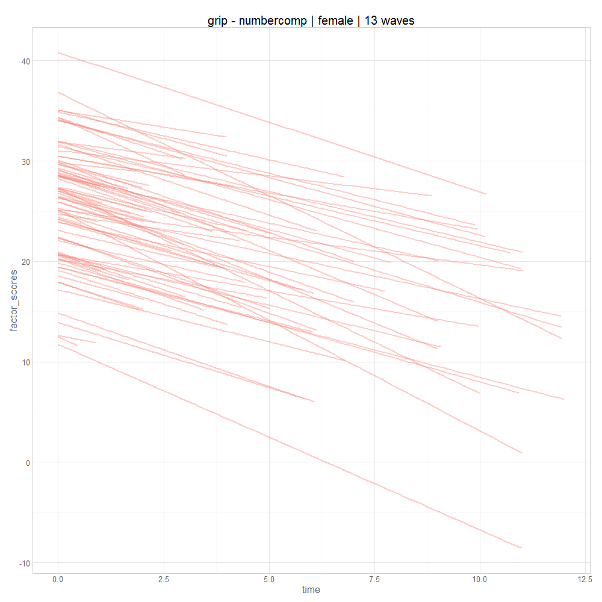

# Title

<!-- These two chunks should be added in the beginning of every .Rmd that you want to source an .R script -->
<!--  The 1st mandatory chunck  -->
<!--  Set the working directory to the repository's base directory -->


<!--  The 2nd mandatory chunck  -->
<!-- Set the report-wide options, and point to the external code file. -->


<!-- Load  packages used in the report --> 


<!-- define Root and other common locations  --> 


<!-- Load any Global functions and variables declared in the R file --> 


<!-- Load 'sourced' R files. --> 


<!-- Load the datasets.   -->


<!-- Tweak the datasets.   -->


<!-- Basic table view.   -->


```r
g <- make_plot(ds=d, temporal="time", values="observed")
g
```


```r
g <- make_plot(ds=d, temporal="time", values="fixed_effects")
g
```


```r
g <- make_plot(ds=d, temporal="time", values="factor_scores")
g
```




```r
g <- make_plot(ds=d, temporal="age", values="observed")
g
```


```r
g <- make_plot(ds=d, temporal="age", values="fixed_effects")
g
```


```r
g <- make_plot(ds=d, temporal="age", values="factor_scores")
g
```


```r
kb_fans(process1="grip", process2="numbercomp", wave_count=16,
                     subgroup="female", outcome="cognitive", sample=10)
```

```

Plot functions:
 - mplus.plot.histogram('C:/Users/koval_000/Documents/GitHub/RADC/outputs/pairs/grip_numbercomp/b1_female_a_grip_numbercomp_16.gh5',variable,bins)
 - mplus.plot.scatterplot('C:/Users/koval_000/Documents/GitHub/RADC/outputs/pairs/grip_numbercomp/b1_female_a_grip_numbercomp_16.gh5',xvar,yvar)

Plot data extraction functions:
 - mplus.list.variables('C:/Users/koval_000/Documents/GitHub/RADC/outputs/pairs/grip_numbercomp/b1_female_a_grip_numbercomp_16.gh5')
 - mplus.get.data('C:/Users/koval_000/Documents/GitHub/RADC/outputs/pairs/grip_numbercomp/b1_female_a_grip_numbercomp_16.gh5',variable)

List of variable names to use in the following functions:
 - mplus.plot.histogram
 - mplus.plot.scatterplot
 - mplus.get.data

Variables:

Plot functions:
 - mplus.plot.histogram('C:/Users/koval_000/Documents/GitHub/RADC/outputs/pairs/grip_numbercomp/b1_female_a_grip_numbercomp_16.gh5',variable,bins)
 - mplus.plot.scatterplot('C:/Users/koval_000/Documents/GitHub/RADC/outputs/pairs/grip_numbercomp/b1_female_a_grip_numbercomp_16.gh5',xvar,yvar)

Plot data extraction functions:
 - mplus.list.variables('C:/Users/koval_000/Documents/GitHub/RADC/outputs/pairs/grip_numbercomp/b1_female_a_grip_numbercomp_16.gh5')
 - mplus.get.data('C:/Users/koval_000/Documents/GitHub/RADC/outputs/pairs/grip_numbercomp/b1_female_a_grip_numbercomp_16.gh5',variable)

List of variable names to use in the following functions:
 - mplus.plot.histogram
 - mplus.plot.scatterplot
 - mplus.get.data

Variables:

Plot functions:
 - mplus.plot.histogram('C:/Users/koval_000/Documents/GitHub/RADC/outputs/pairs/grip_numbercomp/b1_male_a_grip_numbercomp_16.gh5',variable,bins)
 - mplus.plot.scatterplot('C:/Users/koval_000/Documents/GitHub/RADC/outputs/pairs/grip_numbercomp/b1_male_a_grip_numbercomp_16.gh5',xvar,yvar)

Plot data extraction functions:
 - mplus.list.variables('C:/Users/koval_000/Documents/GitHub/RADC/outputs/pairs/grip_numbercomp/b1_male_a_grip_numbercomp_16.gh5')
 - mplus.get.data('C:/Users/koval_000/Documents/GitHub/RADC/outputs/pairs/grip_numbercomp/b1_male_a_grip_numbercomp_16.gh5',variable)

List of variable names to use in the following functions:
 - mplus.plot.histogram
 - mplus.plot.scatterplot
 - mplus.get.data

Variables:

Plot functions:
 - mplus.plot.histogram('C:/Users/koval_000/Documents/GitHub/RADC/outputs/pairs/grip_numbercomp/b1_male_a_grip_numbercomp_16.gh5',variable,bins)
 - mplus.plot.scatterplot('C:/Users/koval_000/Documents/GitHub/RADC/outputs/pairs/grip_numbercomp/b1_male_a_grip_numbercomp_16.gh5',xvar,yvar)

Plot data extraction functions:
 - mplus.list.variables('C:/Users/koval_000/Documents/GitHub/RADC/outputs/pairs/grip_numbercomp/b1_male_a_grip_numbercomp_16.gh5')
 - mplus.get.data('C:/Users/koval_000/Documents/GitHub/RADC/outputs/pairs/grip_numbercomp/b1_male_a_grip_numbercomp_16.gh5',variable)

List of variable names to use in the following functions:
 - mplus.plot.histogram
 - mplus.plot.scatterplot
 - mplus.get.data

Variables:
```


