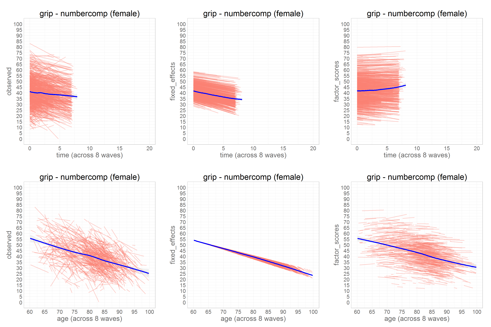

# Title

<!-- These two chunks should be added in the beginning of every .Rmd that you want to source an .R script -->
<!--  The 1st mandatory chunck  -->
<!--  Set the working directory to the repository's base directory -->


<!--  The 2nd mandatory chunck  -->
<!-- Set the report-wide options, and point to the external code file. -->


<!-- Load  packages used in the report --> 


<!-- define Root and other common locations  --> 


<!-- Load any Global functions and variables declared in the R file --> 


<!-- Load 'sourced' R files. --> 


<!-- Load the datasets.   -->


<!-- Tweak the datasets.   -->


<!-- Basic table view.   -->


```r
kb_fans(process1="grip", process2="numbercomp", wave_count=4,
                      subgroup="female", outcome="physical" )
```


```r
kb_fans(process1="grip", process2="numbercomp", wave_count=5,
                      subgroup="female", outcome="physical" )
```


```r
kb_fans(process1="grip", process2="numbercomp", wave_count=6,
                      subgroup="female", outcome="physical" )
```


```r
kb_fans(process1="grip", process2="numbercomp", wave_count=7,
                      subgroup="female", outcome="physical" )
```


```r
kb_fans(process1="grip", process2="numbercomp", wave_count=8,
                      subgroup="female", outcome="physical" )
```




```r
kb_fans(process1="grip", process2="numbercomp", wave_count=9,
                      subgroup="female", outcome="physical" )
```


```r
kb_fans(process1="grip", process2="numbercomp", wave_count=10,
                      subgroup="female", outcome="physical" )
```


```r
kb_fans(process1="grip", process2="numbercomp", wave_count=11,
                      subgroup="female", outcome="physical" )
```


```r
kb_fans(process1="grip", process2="numbercomp", wave_count=12,
                      subgroup="female", outcome="physical" )
```


```r
kb_fans(process1="grip", process2="numbercomp", wave_count=13,
                      subgroup="female", outcome="physical" )
```


```r
kb_fans(process1="grip", process2="numbercomp", wave_count=14,
                      subgroup="female", outcome="physical" )
```


```r
kb_fans(process1="grip", process2="numbercomp", wave_count=15,
                      subgroup="female", outcome="physical" )
```


```r
kb_fans(process1="grip", process2="numbercomp", wave_count=16,
                      subgroup="female", outcome="physical" )
```


