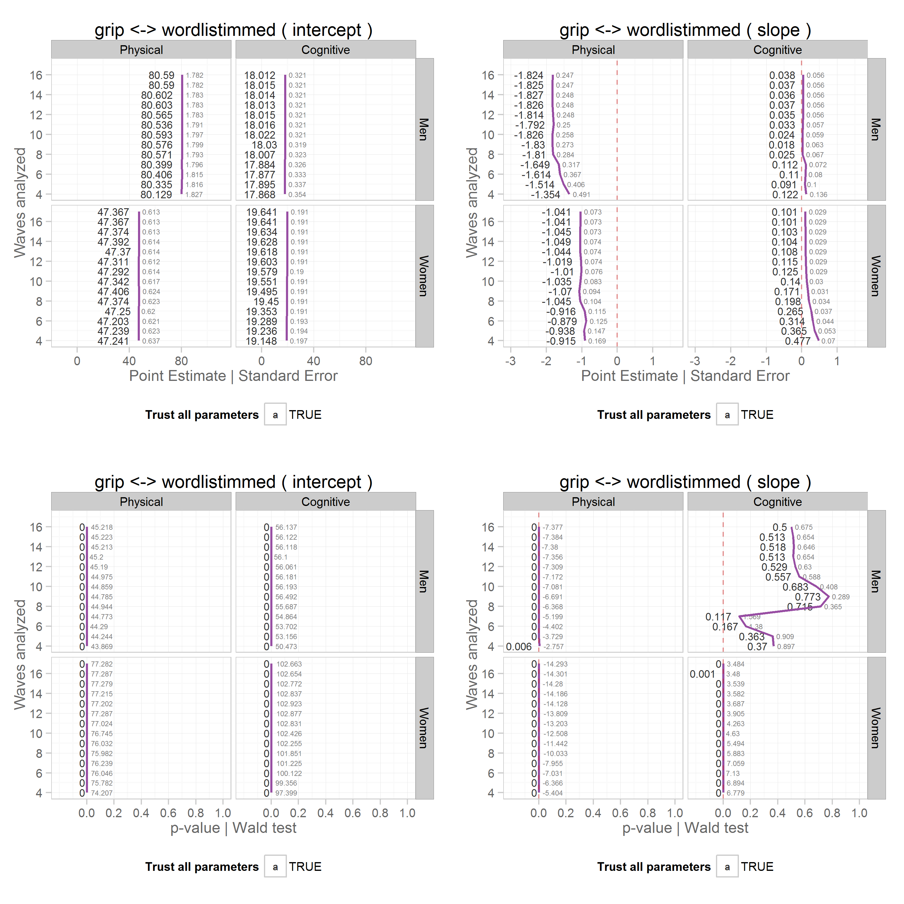

# Title

<!-- These two chunks should be added in the beginning of every .Rmd that you want to source an .R script -->
<!--  The 1st mandatory chunck  -->
<!--  Set the working directory to the repository's base directory -->


<!--  The 2nd mandatory chunck  -->
<!-- Set the report-wide options, and point to the external code file. -->


<!-- Load 'sourced' R files.  Suppress the output when loading packages. --> 


<!-- Load the sources.  Suppress the output when loading sources. --> 


<!-- Load any Global functions and variables declared in the R file.  Suppress the output. --> 


<!-- Declare any global functions specific to a Rmd output.  Suppress the output. --> 


<!-- Load the datasets.   -->


<!-- Tweak the datasets.   -->


<!-- Basic table view.   -->


## 1 
 

```
'data.frame':	368 obs. of  11 variables:
 $ wave_count       : num  4 4 4 4 4 4 4 4 4 4 ...
 $ subgroup         : chr  "female" "male" "female" "male" ...
 $ physical_measure : chr  "grip" "grip" "grip" "grip" ...
 $ cognitive_measure: chr  "bnt" "bnt" "bnt" "bnt" ...
 $ converged        : int  1 1 1 1 1 1 1 1 1 1 ...
 $ trust_all        : logi  TRUE TRUE TRUE TRUE TRUE TRUE ...
 $ parameter        : chr  "GAMMA" "GAMMA" "GAMMA" "GAMMA" ...
 $ value            : num  47.272 80.192 0.636 1.824 74.356 ...
 $ process          : chr  "physical" "physical" "physical" "physical" ...
 $ term             : chr  "intercept" "intercept" "intercept" "intercept" ...
 $ record           : chr  "est" "est" "se" "se" ...
'data.frame':	368 obs. of  14 variables:
 $ wave_count       : num  4 4 4 4 4 4 4 4 4 4 ...
 $ subgroup         : chr  "female" "male" "female" "male" ...
 $ physical_measure : chr  "grip" "grip" "grip" "grip" ...
 $ cognitive_measure: chr  "bnt" "bnt" "bnt" "bnt" ...
 $ converged        : int  1 1 1 1 1 1 1 1 1 1 ...
 $ trust_all        : logi  TRUE TRUE TRUE TRUE TRUE TRUE ...
 $ parameter        : chr  "GAMMA" "GAMMA" "GAMMA" "GAMMA" ...
 $ value            : num  47.272 80.192 0.636 1.824 74.356 ...
 $ process          : chr  "physical" "physical" "physical" "physical" ...
 $ term             : chr  "intercept" "intercept" "intercept" "intercept" ...
 $ record           : chr  "est" "est" "se" "se" ...
 $ processF         : Factor w/ 2 levels "Physical","Cognitive": 1 1 1 1 1 1 1 1 2 2 ...
 $ termF            : Factor w/ 2 levels "Initial status",..: 1 1 1 1 1 1 1 1 1 1 ...
 $ subgroupF        : Factor w/ 2 levels "Men","Women": 2 1 2 1 2 1 2 1 2 1 ...
'data.frame':	368 obs. of  11 variables:
 $ wave_count       : num  4 4 4 4 4 4 4 4 4 4 ...
 $ subgroup         : chr  "female" "male" "female" "male" ...
 $ physical_measure : chr  "grip" "grip" "grip" "grip" ...
 $ cognitive_measure: chr  "bnt" "bnt" "bnt" "bnt" ...
 $ converged        : int  1 1 1 1 1 1 1 1 1 1 ...
 $ trust_all        : logi  TRUE TRUE TRUE TRUE TRUE TRUE ...
 $ parameter        : chr  "GAMMA" "GAMMA" "GAMMA" "GAMMA" ...
 $ value            : num  47.272 80.192 0.636 1.824 74.356 ...
 $ process          : chr  "physical" "physical" "physical" "physical" ...
 $ term             : chr  "intercept" "intercept" "intercept" "intercept" ...
 $ record           : chr  "est" "est" "se" "se" ...
'data.frame':	368 obs. of  14 variables:
 $ wave_count       : num  4 4 4 4 4 4 4 4 4 4 ...
 $ subgroup         : chr  "female" "male" "female" "male" ...
 $ physical_measure : chr  "grip" "grip" "grip" "grip" ...
 $ cognitive_measure: chr  "bnt" "bnt" "bnt" "bnt" ...
 $ converged        : int  1 1 1 1 1 1 1 1 1 1 ...
 $ trust_all        : logi  TRUE TRUE TRUE TRUE TRUE TRUE ...
 $ parameter        : chr  "GAMMA" "GAMMA" "GAMMA" "GAMMA" ...
 $ value            : num  47.272 80.192 0.636 1.824 74.356 ...
 $ process          : chr  "physical" "physical" "physical" "physical" ...
 $ term             : chr  "intercept" "intercept" "intercept" "intercept" ...
 $ record           : chr  "est" "est" "se" "se" ...
 $ processF         : Factor w/ 2 levels "Physical","Cognitive": 1 1 1 1 1 1 1 1 2 2 ...
 $ termF            : Factor w/ 2 levels "Initial status",..: 1 1 1 1 1 1 1 1 1 1 ...
 $ subgroupF        : Factor w/ 2 levels "Men","Women": 2 1 2 1 2 1 2 1 2 1 ...
'data.frame':	368 obs. of  11 variables:
 $ wave_count       : num  4 4 4 4 4 4 4 4 4 4 ...
 $ subgroup         : chr  "female" "male" "female" "male" ...
 $ physical_measure : chr  "grip" "grip" "grip" "grip" ...
 $ cognitive_measure: chr  "bnt" "bnt" "bnt" "bnt" ...
 $ converged        : int  1 1 1 1 1 1 1 1 1 1 ...
 $ trust_all        : logi  TRUE TRUE TRUE TRUE TRUE TRUE ...
 $ parameter        : chr  "GAMMA" "GAMMA" "GAMMA" "GAMMA" ...
 $ value            : num  47.272 80.192 0.636 1.824 74.356 ...
 $ process          : chr  "physical" "physical" "physical" "physical" ...
 $ term             : chr  "intercept" "intercept" "intercept" "intercept" ...
 $ record           : chr  "est" "est" "se" "se" ...
'data.frame':	368 obs. of  14 variables:
 $ wave_count       : num  4 4 4 4 4 4 4 4 4 4 ...
 $ subgroup         : chr  "female" "male" "female" "male" ...
 $ physical_measure : chr  "grip" "grip" "grip" "grip" ...
 $ cognitive_measure: chr  "bnt" "bnt" "bnt" "bnt" ...
 $ converged        : int  1 1 1 1 1 1 1 1 1 1 ...
 $ trust_all        : logi  TRUE TRUE TRUE TRUE TRUE TRUE ...
 $ parameter        : chr  "GAMMA" "GAMMA" "GAMMA" "GAMMA" ...
 $ value            : num  47.272 80.192 0.636 1.824 74.356 ...
 $ process          : chr  "physical" "physical" "physical" "physical" ...
 $ term             : chr  "intercept" "intercept" "intercept" "intercept" ...
 $ record           : chr  "est" "est" "se" "se" ...
 $ processF         : Factor w/ 2 levels "Physical","Cognitive": 1 1 1 1 1 1 1 1 2 2 ...
 $ termF            : Factor w/ 2 levels "Initial status",..: 1 1 1 1 1 1 1 1 1 1 ...
 $ subgroupF        : Factor w/ 2 levels "Men","Women": 2 1 2 1 2 1 2 1 2 1 ...
'data.frame':	368 obs. of  11 variables:
 $ wave_count       : num  4 4 4 4 4 4 4 4 4 4 ...
 $ subgroup         : chr  "female" "male" "female" "male" ...
 $ physical_measure : chr  "grip" "grip" "grip" "grip" ...
 $ cognitive_measure: chr  "bnt" "bnt" "bnt" "bnt" ...
 $ converged        : int  1 1 1 1 1 1 1 1 1 1 ...
 $ trust_all        : logi  TRUE TRUE TRUE TRUE TRUE TRUE ...
 $ parameter        : chr  "GAMMA" "GAMMA" "GAMMA" "GAMMA" ...
 $ value            : num  47.272 80.192 0.636 1.824 74.356 ...
 $ process          : chr  "physical" "physical" "physical" "physical" ...
 $ term             : chr  "intercept" "intercept" "intercept" "intercept" ...
 $ record           : chr  "est" "est" "se" "se" ...
'data.frame':	368 obs. of  14 variables:
 $ wave_count       : num  4 4 4 4 4 4 4 4 4 4 ...
 $ subgroup         : chr  "female" "male" "female" "male" ...
 $ physical_measure : chr  "grip" "grip" "grip" "grip" ...
 $ cognitive_measure: chr  "bnt" "bnt" "bnt" "bnt" ...
 $ converged        : int  1 1 1 1 1 1 1 1 1 1 ...
 $ trust_all        : logi  TRUE TRUE TRUE TRUE TRUE TRUE ...
 $ parameter        : chr  "GAMMA" "GAMMA" "GAMMA" "GAMMA" ...
 $ value            : num  47.272 80.192 0.636 1.824 74.356 ...
 $ process          : chr  "physical" "physical" "physical" "physical" ...
 $ term             : chr  "intercept" "intercept" "intercept" "intercept" ...
 $ record           : chr  "est" "est" "se" "se" ...
 $ processF         : Factor w/ 2 levels "Physical","Cognitive": 1 1 1 1 1 1 1 1 2 2 ...
 $ termF            : Factor w/ 2 levels "Initial status",..: 1 1 1 1 1 1 1 1 1 1 ...
 $ subgroupF        : Factor w/ 2 levels "Men","Women": 2 1 2 1 2 1 2 1 2 1 ...
'data.frame':	368 obs. of  11 variables:
 $ wave_count       : num  4 4 4 4 4 4 4 4 4 4 ...
 $ subgroup         : chr  "female" "male" "female" "male" ...
 $ physical_measure : chr  "grip" "grip" "grip" "grip" ...
 $ cognitive_measure: chr  "bnt" "bnt" "bnt" "bnt" ...
 $ converged        : int  1 1 1 1 1 1 1 1 1 1 ...
 $ trust_all        : logi  TRUE TRUE TRUE TRUE TRUE TRUE ...
 $ parameter        : chr  "GAMMA" "GAMMA" "GAMMA" "GAMMA" ...
 $ value            : num  47.272 80.192 0.636 1.824 74.356 ...
 $ process          : chr  "physical" "physical" "physical" "physical" ...
 $ term             : chr  "intercept" "intercept" "intercept" "intercept" ...
 $ record           : chr  "est" "est" "se" "se" ...
'data.frame':	368 obs. of  14 variables:
 $ wave_count       : num  4 4 4 4 4 4 4 4 4 4 ...
 $ subgroup         : chr  "female" "male" "female" "male" ...
 $ physical_measure : chr  "grip" "grip" "grip" "grip" ...
 $ cognitive_measure: chr  "bnt" "bnt" "bnt" "bnt" ...
 $ converged        : int  1 1 1 1 1 1 1 1 1 1 ...
 $ trust_all        : logi  TRUE TRUE TRUE TRUE TRUE TRUE ...
 $ parameter        : chr  "GAMMA" "GAMMA" "GAMMA" "GAMMA" ...
 $ value            : num  47.272 80.192 0.636 1.824 74.356 ...
 $ process          : chr  "physical" "physical" "physical" "physical" ...
 $ term             : chr  "intercept" "intercept" "intercept" "intercept" ...
 $ record           : chr  "est" "est" "se" "se" ...
 $ processF         : Factor w/ 2 levels "Physical","Cognitive": 1 1 1 1 1 1 1 1 2 2 ...
 $ termF            : Factor w/ 2 levels "Initial status",..: 1 1 1 1 1 1 1 1 1 1 ...
 $ subgroupF        : Factor w/ 2 levels "Men","Women": 2 1 2 1 2 1 2 1 2 1 ...
```

## 2
 

```
'data.frame':	432 obs. of  11 variables:
 $ wave_count       : num  4 4 4 4 4 4 4 4 4 4 ...
 $ subgroup         : chr  "female" "male" "female" "male" ...
 $ physical_measure : chr  "grip" "grip" "grip" "grip" ...
 $ cognitive_measure: chr  "bostonstorydelay" "bostonstorydelay" "bostonstorydelay" "bostonstorydelay" ...
 $ converged        : int  1 1 1 1 1 1 1 1 1 1 ...
 $ trust_all        : logi  TRUE TRUE TRUE TRUE TRUE TRUE ...
 $ parameter        : chr  "GAMMA" "GAMMA" "GAMMA" "GAMMA" ...
 $ value            : num  47.292 80.073 0.636 1.827 74.398 ...
 $ process          : chr  "physical" "physical" "physical" "physical" ...
 $ term             : chr  "intercept" "intercept" "intercept" "intercept" ...
 $ record           : chr  "est" "est" "se" "se" ...
'data.frame':	432 obs. of  14 variables:
 $ wave_count       : num  4 4 4 4 4 4 4 4 4 4 ...
 $ subgroup         : chr  "female" "male" "female" "male" ...
 $ physical_measure : chr  "grip" "grip" "grip" "grip" ...
 $ cognitive_measure: chr  "bostonstorydelay" "bostonstorydelay" "bostonstorydelay" "bostonstorydelay" ...
 $ converged        : int  1 1 1 1 1 1 1 1 1 1 ...
 $ trust_all        : logi  TRUE TRUE TRUE TRUE TRUE TRUE ...
 $ parameter        : chr  "GAMMA" "GAMMA" "GAMMA" "GAMMA" ...
 $ value            : num  47.292 80.073 0.636 1.827 74.398 ...
 $ process          : chr  "physical" "physical" "physical" "physical" ...
 $ term             : chr  "intercept" "intercept" "intercept" "intercept" ...
 $ record           : chr  "est" "est" "se" "se" ...
 $ processF         : Factor w/ 2 levels "Physical","Cognitive": 1 1 1 1 1 1 1 1 2 2 ...
 $ termF            : Factor w/ 2 levels "Initial status",..: 1 1 1 1 1 1 1 1 1 1 ...
 $ subgroupF        : Factor w/ 2 levels "Men","Women": 2 1 2 1 2 1 2 1 2 1 ...
'data.frame':	432 obs. of  11 variables:
 $ wave_count       : num  4 4 4 4 4 4 4 4 4 4 ...
 $ subgroup         : chr  "female" "male" "female" "male" ...
 $ physical_measure : chr  "grip" "grip" "grip" "grip" ...
 $ cognitive_measure: chr  "bostonstorydelay" "bostonstorydelay" "bostonstorydelay" "bostonstorydelay" ...
 $ converged        : int  1 1 1 1 1 1 1 1 1 1 ...
 $ trust_all        : logi  TRUE TRUE TRUE TRUE TRUE TRUE ...
 $ parameter        : chr  "GAMMA" "GAMMA" "GAMMA" "GAMMA" ...
 $ value            : num  47.292 80.073 0.636 1.827 74.398 ...
 $ process          : chr  "physical" "physical" "physical" "physical" ...
 $ term             : chr  "intercept" "intercept" "intercept" "intercept" ...
 $ record           : chr  "est" "est" "se" "se" ...
'data.frame':	432 obs. of  14 variables:
 $ wave_count       : num  4 4 4 4 4 4 4 4 4 4 ...
 $ subgroup         : chr  "female" "male" "female" "male" ...
 $ physical_measure : chr  "grip" "grip" "grip" "grip" ...
 $ cognitive_measure: chr  "bostonstorydelay" "bostonstorydelay" "bostonstorydelay" "bostonstorydelay" ...
 $ converged        : int  1 1 1 1 1 1 1 1 1 1 ...
 $ trust_all        : logi  TRUE TRUE TRUE TRUE TRUE TRUE ...
 $ parameter        : chr  "GAMMA" "GAMMA" "GAMMA" "GAMMA" ...
 $ value            : num  47.292 80.073 0.636 1.827 74.398 ...
 $ process          : chr  "physical" "physical" "physical" "physical" ...
 $ term             : chr  "intercept" "intercept" "intercept" "intercept" ...
 $ record           : chr  "est" "est" "se" "se" ...
 $ processF         : Factor w/ 2 levels "Physical","Cognitive": 1 1 1 1 1 1 1 1 2 2 ...
 $ termF            : Factor w/ 2 levels "Initial status",..: 1 1 1 1 1 1 1 1 1 1 ...
 $ subgroupF        : Factor w/ 2 levels "Men","Women": 2 1 2 1 2 1 2 1 2 1 ...
'data.frame':	432 obs. of  11 variables:
 $ wave_count       : num  4 4 4 4 4 4 4 4 4 4 ...
 $ subgroup         : chr  "female" "male" "female" "male" ...
 $ physical_measure : chr  "grip" "grip" "grip" "grip" ...
 $ cognitive_measure: chr  "bostonstorydelay" "bostonstorydelay" "bostonstorydelay" "bostonstorydelay" ...
 $ converged        : int  1 1 1 1 1 1 1 1 1 1 ...
 $ trust_all        : logi  TRUE TRUE TRUE TRUE TRUE TRUE ...
 $ parameter        : chr  "GAMMA" "GAMMA" "GAMMA" "GAMMA" ...
 $ value            : num  47.292 80.073 0.636 1.827 74.398 ...
 $ process          : chr  "physical" "physical" "physical" "physical" ...
 $ term             : chr  "intercept" "intercept" "intercept" "intercept" ...
 $ record           : chr  "est" "est" "se" "se" ...
'data.frame':	432 obs. of  14 variables:
 $ wave_count       : num  4 4 4 4 4 4 4 4 4 4 ...
 $ subgroup         : chr  "female" "male" "female" "male" ...
 $ physical_measure : chr  "grip" "grip" "grip" "grip" ...
 $ cognitive_measure: chr  "bostonstorydelay" "bostonstorydelay" "bostonstorydelay" "bostonstorydelay" ...
 $ converged        : int  1 1 1 1 1 1 1 1 1 1 ...
 $ trust_all        : logi  TRUE TRUE TRUE TRUE TRUE TRUE ...
 $ parameter        : chr  "GAMMA" "GAMMA" "GAMMA" "GAMMA" ...
 $ value            : num  47.292 80.073 0.636 1.827 74.398 ...
 $ process          : chr  "physical" "physical" "physical" "physical" ...
 $ term             : chr  "intercept" "intercept" "intercept" "intercept" ...
 $ record           : chr  "est" "est" "se" "se" ...
 $ processF         : Factor w/ 2 levels "Physical","Cognitive": 1 1 1 1 1 1 1 1 2 2 ...
 $ termF            : Factor w/ 2 levels "Initial status",..: 1 1 1 1 1 1 1 1 1 1 ...
 $ subgroupF        : Factor w/ 2 levels "Men","Women": 2 1 2 1 2 1 2 1 2 1 ...
'data.frame':	432 obs. of  11 variables:
 $ wave_count       : num  4 4 4 4 4 4 4 4 4 4 ...
 $ subgroup         : chr  "female" "male" "female" "male" ...
 $ physical_measure : chr  "grip" "grip" "grip" "grip" ...
 $ cognitive_measure: chr  "bostonstorydelay" "bostonstorydelay" "bostonstorydelay" "bostonstorydelay" ...
 $ converged        : int  1 1 1 1 1 1 1 1 1 1 ...
 $ trust_all        : logi  TRUE TRUE TRUE TRUE TRUE TRUE ...
 $ parameter        : chr  "GAMMA" "GAMMA" "GAMMA" "GAMMA" ...
 $ value            : num  47.292 80.073 0.636 1.827 74.398 ...
 $ process          : chr  "physical" "physical" "physical" "physical" ...
 $ term             : chr  "intercept" "intercept" "intercept" "intercept" ...
 $ record           : chr  "est" "est" "se" "se" ...
'data.frame':	432 obs. of  14 variables:
 $ wave_count       : num  4 4 4 4 4 4 4 4 4 4 ...
 $ subgroup         : chr  "female" "male" "female" "male" ...
 $ physical_measure : chr  "grip" "grip" "grip" "grip" ...
 $ cognitive_measure: chr  "bostonstorydelay" "bostonstorydelay" "bostonstorydelay" "bostonstorydelay" ...
 $ converged        : int  1 1 1 1 1 1 1 1 1 1 ...
 $ trust_all        : logi  TRUE TRUE TRUE TRUE TRUE TRUE ...
 $ parameter        : chr  "GAMMA" "GAMMA" "GAMMA" "GAMMA" ...
 $ value            : num  47.292 80.073 0.636 1.827 74.398 ...
 $ process          : chr  "physical" "physical" "physical" "physical" ...
 $ term             : chr  "intercept" "intercept" "intercept" "intercept" ...
 $ record           : chr  "est" "est" "se" "se" ...
 $ processF         : Factor w/ 2 levels "Physical","Cognitive": 1 1 1 1 1 1 1 1 2 2 ...
 $ termF            : Factor w/ 2 levels "Initial status",..: 1 1 1 1 1 1 1 1 1 1 ...
 $ subgroupF        : Factor w/ 2 levels "Men","Women": 2 1 2 1 2 1 2 1 2 1 ...
'data.frame':	432 obs. of  11 variables:
 $ wave_count       : num  4 4 4 4 4 4 4 4 4 4 ...
 $ subgroup         : chr  "female" "male" "female" "male" ...
 $ physical_measure : chr  "grip" "grip" "grip" "grip" ...
 $ cognitive_measure: chr  "bostonstorydelay" "bostonstorydelay" "bostonstorydelay" "bostonstorydelay" ...
 $ converged        : int  1 1 1 1 1 1 1 1 1 1 ...
 $ trust_all        : logi  TRUE TRUE TRUE TRUE TRUE TRUE ...
 $ parameter        : chr  "GAMMA" "GAMMA" "GAMMA" "GAMMA" ...
 $ value            : num  47.292 80.073 0.636 1.827 74.398 ...
 $ process          : chr  "physical" "physical" "physical" "physical" ...
 $ term             : chr  "intercept" "intercept" "intercept" "intercept" ...
 $ record           : chr  "est" "est" "se" "se" ...
'data.frame':	432 obs. of  14 variables:
 $ wave_count       : num  4 4 4 4 4 4 4 4 4 4 ...
 $ subgroup         : chr  "female" "male" "female" "male" ...
 $ physical_measure : chr  "grip" "grip" "grip" "grip" ...
 $ cognitive_measure: chr  "bostonstorydelay" "bostonstorydelay" "bostonstorydelay" "bostonstorydelay" ...
 $ converged        : int  1 1 1 1 1 1 1 1 1 1 ...
 $ trust_all        : logi  TRUE TRUE TRUE TRUE TRUE TRUE ...
 $ parameter        : chr  "GAMMA" "GAMMA" "GAMMA" "GAMMA" ...
 $ value            : num  47.292 80.073 0.636 1.827 74.398 ...
 $ process          : chr  "physical" "physical" "physical" "physical" ...
 $ term             : chr  "intercept" "intercept" "intercept" "intercept" ...
 $ record           : chr  "est" "est" "se" "se" ...
 $ processF         : Factor w/ 2 levels "Physical","Cognitive": 1 1 1 1 1 1 1 1 2 2 ...
 $ termF            : Factor w/ 2 levels "Initial status",..: 1 1 1 1 1 1 1 1 1 1 ...
 $ subgroupF        : Factor w/ 2 levels "Men","Women": 2 1 2 1 2 1 2 1 2 1 ...
```


## 3 
 

```
'data.frame':	384 obs. of  11 variables:
 $ wave_count       : num  4 4 4 4 4 4 4 4 4 4 ...
 $ subgroup         : chr  "female" "male" "female" "male" ...
 $ physical_measure : chr  "grip" "grip" "grip" "grip" ...
 $ cognitive_measure: chr  "bostonstoryimm" "bostonstoryimm" "bostonstoryimm" "bostonstoryimm" ...
 $ converged        : int  1 1 1 1 1 1 1 1 1 1 ...
 $ trust_all        : logi  TRUE TRUE TRUE TRUE TRUE TRUE ...
 $ parameter        : chr  "GAMMA" "GAMMA" "GAMMA" "GAMMA" ...
 $ value            : num  47.291 80.067 0.635 1.827 74.485 ...
 $ process          : chr  "physical" "physical" "physical" "physical" ...
 $ term             : chr  "intercept" "intercept" "intercept" "intercept" ...
 $ record           : chr  "est" "est" "se" "se" ...
'data.frame':	384 obs. of  14 variables:
 $ wave_count       : num  4 4 4 4 4 4 4 4 4 4 ...
 $ subgroup         : chr  "female" "male" "female" "male" ...
 $ physical_measure : chr  "grip" "grip" "grip" "grip" ...
 $ cognitive_measure: chr  "bostonstoryimm" "bostonstoryimm" "bostonstoryimm" "bostonstoryimm" ...
 $ converged        : int  1 1 1 1 1 1 1 1 1 1 ...
 $ trust_all        : logi  TRUE TRUE TRUE TRUE TRUE TRUE ...
 $ parameter        : chr  "GAMMA" "GAMMA" "GAMMA" "GAMMA" ...
 $ value            : num  47.291 80.067 0.635 1.827 74.485 ...
 $ process          : chr  "physical" "physical" "physical" "physical" ...
 $ term             : chr  "intercept" "intercept" "intercept" "intercept" ...
 $ record           : chr  "est" "est" "se" "se" ...
 $ processF         : Factor w/ 2 levels "Physical","Cognitive": 1 1 1 1 1 1 1 1 2 2 ...
 $ termF            : Factor w/ 2 levels "Initial status",..: 1 1 1 1 1 1 1 1 1 1 ...
 $ subgroupF        : Factor w/ 2 levels "Men","Women": 2 1 2 1 2 1 2 1 2 1 ...
'data.frame':	384 obs. of  11 variables:
 $ wave_count       : num  4 4 4 4 4 4 4 4 4 4 ...
 $ subgroup         : chr  "female" "male" "female" "male" ...
 $ physical_measure : chr  "grip" "grip" "grip" "grip" ...
 $ cognitive_measure: chr  "bostonstoryimm" "bostonstoryimm" "bostonstoryimm" "bostonstoryimm" ...
 $ converged        : int  1 1 1 1 1 1 1 1 1 1 ...
 $ trust_all        : logi  TRUE TRUE TRUE TRUE TRUE TRUE ...
 $ parameter        : chr  "GAMMA" "GAMMA" "GAMMA" "GAMMA" ...
 $ value            : num  47.291 80.067 0.635 1.827 74.485 ...
 $ process          : chr  "physical" "physical" "physical" "physical" ...
 $ term             : chr  "intercept" "intercept" "intercept" "intercept" ...
 $ record           : chr  "est" "est" "se" "se" ...
'data.frame':	384 obs. of  14 variables:
 $ wave_count       : num  4 4 4 4 4 4 4 4 4 4 ...
 $ subgroup         : chr  "female" "male" "female" "male" ...
 $ physical_measure : chr  "grip" "grip" "grip" "grip" ...
 $ cognitive_measure: chr  "bostonstoryimm" "bostonstoryimm" "bostonstoryimm" "bostonstoryimm" ...
 $ converged        : int  1 1 1 1 1 1 1 1 1 1 ...
 $ trust_all        : logi  TRUE TRUE TRUE TRUE TRUE TRUE ...
 $ parameter        : chr  "GAMMA" "GAMMA" "GAMMA" "GAMMA" ...
 $ value            : num  47.291 80.067 0.635 1.827 74.485 ...
 $ process          : chr  "physical" "physical" "physical" "physical" ...
 $ term             : chr  "intercept" "intercept" "intercept" "intercept" ...
 $ record           : chr  "est" "est" "se" "se" ...
 $ processF         : Factor w/ 2 levels "Physical","Cognitive": 1 1 1 1 1 1 1 1 2 2 ...
 $ termF            : Factor w/ 2 levels "Initial status",..: 1 1 1 1 1 1 1 1 1 1 ...
 $ subgroupF        : Factor w/ 2 levels "Men","Women": 2 1 2 1 2 1 2 1 2 1 ...
'data.frame':	384 obs. of  11 variables:
 $ wave_count       : num  4 4 4 4 4 4 4 4 4 4 ...
 $ subgroup         : chr  "female" "male" "female" "male" ...
 $ physical_measure : chr  "grip" "grip" "grip" "grip" ...
 $ cognitive_measure: chr  "bostonstoryimm" "bostonstoryimm" "bostonstoryimm" "bostonstoryimm" ...
 $ converged        : int  1 1 1 1 1 1 1 1 1 1 ...
 $ trust_all        : logi  TRUE TRUE TRUE TRUE TRUE TRUE ...
 $ parameter        : chr  "GAMMA" "GAMMA" "GAMMA" "GAMMA" ...
 $ value            : num  47.291 80.067 0.635 1.827 74.485 ...
 $ process          : chr  "physical" "physical" "physical" "physical" ...
 $ term             : chr  "intercept" "intercept" "intercept" "intercept" ...
 $ record           : chr  "est" "est" "se" "se" ...
'data.frame':	384 obs. of  14 variables:
 $ wave_count       : num  4 4 4 4 4 4 4 4 4 4 ...
 $ subgroup         : chr  "female" "male" "female" "male" ...
 $ physical_measure : chr  "grip" "grip" "grip" "grip" ...
 $ cognitive_measure: chr  "bostonstoryimm" "bostonstoryimm" "bostonstoryimm" "bostonstoryimm" ...
 $ converged        : int  1 1 1 1 1 1 1 1 1 1 ...
 $ trust_all        : logi  TRUE TRUE TRUE TRUE TRUE TRUE ...
 $ parameter        : chr  "GAMMA" "GAMMA" "GAMMA" "GAMMA" ...
 $ value            : num  47.291 80.067 0.635 1.827 74.485 ...
 $ process          : chr  "physical" "physical" "physical" "physical" ...
 $ term             : chr  "intercept" "intercept" "intercept" "intercept" ...
 $ record           : chr  "est" "est" "se" "se" ...
 $ processF         : Factor w/ 2 levels "Physical","Cognitive": 1 1 1 1 1 1 1 1 2 2 ...
 $ termF            : Factor w/ 2 levels "Initial status",..: 1 1 1 1 1 1 1 1 1 1 ...
 $ subgroupF        : Factor w/ 2 levels "Men","Women": 2 1 2 1 2 1 2 1 2 1 ...
'data.frame':	384 obs. of  11 variables:
 $ wave_count       : num  4 4 4 4 4 4 4 4 4 4 ...
 $ subgroup         : chr  "female" "male" "female" "male" ...
 $ physical_measure : chr  "grip" "grip" "grip" "grip" ...
 $ cognitive_measure: chr  "bostonstoryimm" "bostonstoryimm" "bostonstoryimm" "bostonstoryimm" ...
 $ converged        : int  1 1 1 1 1 1 1 1 1 1 ...
 $ trust_all        : logi  TRUE TRUE TRUE TRUE TRUE TRUE ...
 $ parameter        : chr  "GAMMA" "GAMMA" "GAMMA" "GAMMA" ...
 $ value            : num  47.291 80.067 0.635 1.827 74.485 ...
 $ process          : chr  "physical" "physical" "physical" "physical" ...
 $ term             : chr  "intercept" "intercept" "intercept" "intercept" ...
 $ record           : chr  "est" "est" "se" "se" ...
'data.frame':	384 obs. of  14 variables:
 $ wave_count       : num  4 4 4 4 4 4 4 4 4 4 ...
 $ subgroup         : chr  "female" "male" "female" "male" ...
 $ physical_measure : chr  "grip" "grip" "grip" "grip" ...
 $ cognitive_measure: chr  "bostonstoryimm" "bostonstoryimm" "bostonstoryimm" "bostonstoryimm" ...
 $ converged        : int  1 1 1 1 1 1 1 1 1 1 ...
 $ trust_all        : logi  TRUE TRUE TRUE TRUE TRUE TRUE ...
 $ parameter        : chr  "GAMMA" "GAMMA" "GAMMA" "GAMMA" ...
 $ value            : num  47.291 80.067 0.635 1.827 74.485 ...
 $ process          : chr  "physical" "physical" "physical" "physical" ...
 $ term             : chr  "intercept" "intercept" "intercept" "intercept" ...
 $ record           : chr  "est" "est" "se" "se" ...
 $ processF         : Factor w/ 2 levels "Physical","Cognitive": 1 1 1 1 1 1 1 1 2 2 ...
 $ termF            : Factor w/ 2 levels "Initial status",..: 1 1 1 1 1 1 1 1 1 1 ...
 $ subgroupF        : Factor w/ 2 levels "Men","Women": 2 1 2 1 2 1 2 1 2 1 ...
'data.frame':	384 obs. of  11 variables:
 $ wave_count       : num  4 4 4 4 4 4 4 4 4 4 ...
 $ subgroup         : chr  "female" "male" "female" "male" ...
 $ physical_measure : chr  "grip" "grip" "grip" "grip" ...
 $ cognitive_measure: chr  "bostonstoryimm" "bostonstoryimm" "bostonstoryimm" "bostonstoryimm" ...
 $ converged        : int  1 1 1 1 1 1 1 1 1 1 ...
 $ trust_all        : logi  TRUE TRUE TRUE TRUE TRUE TRUE ...
 $ parameter        : chr  "GAMMA" "GAMMA" "GAMMA" "GAMMA" ...
 $ value            : num  47.291 80.067 0.635 1.827 74.485 ...
 $ process          : chr  "physical" "physical" "physical" "physical" ...
 $ term             : chr  "intercept" "intercept" "intercept" "intercept" ...
 $ record           : chr  "est" "est" "se" "se" ...
'data.frame':	384 obs. of  14 variables:
 $ wave_count       : num  4 4 4 4 4 4 4 4 4 4 ...
 $ subgroup         : chr  "female" "male" "female" "male" ...
 $ physical_measure : chr  "grip" "grip" "grip" "grip" ...
 $ cognitive_measure: chr  "bostonstoryimm" "bostonstoryimm" "bostonstoryimm" "bostonstoryimm" ...
 $ converged        : int  1 1 1 1 1 1 1 1 1 1 ...
 $ trust_all        : logi  TRUE TRUE TRUE TRUE TRUE TRUE ...
 $ parameter        : chr  "GAMMA" "GAMMA" "GAMMA" "GAMMA" ...
 $ value            : num  47.291 80.067 0.635 1.827 74.485 ...
 $ process          : chr  "physical" "physical" "physical" "physical" ...
 $ term             : chr  "intercept" "intercept" "intercept" "intercept" ...
 $ record           : chr  "est" "est" "se" "se" ...
 $ processF         : Factor w/ 2 levels "Physical","Cognitive": 1 1 1 1 1 1 1 1 2 2 ...
 $ termF            : Factor w/ 2 levels "Initial status",..: 1 1 1 1 1 1 1 1 1 1 ...
 $ subgroupF        : Factor w/ 2 levels "Men","Women": 2 1 2 1 2 1 2 1 2 1 ...
```


##  4 Grip <-> Categories
 

```
'data.frame':	432 obs. of  11 variables:
 $ wave_count       : num  4 4 4 4 4 4 4 4 4 4 ...
 $ subgroup         : chr  "female" "male" "female" "male" ...
 $ physical_measure : chr  "grip" "grip" "grip" "grip" ...
 $ cognitive_measure: chr  "categories" "digitsymbols" "categories" "digitsymbols" ...
 $ converged        : int  1 1 1 1 1 1 1 1 1 1 ...
 $ trust_all        : logi  TRUE TRUE TRUE TRUE TRUE TRUE ...
 $ parameter        : chr  "GAMMA" "GAMMA" "GAMMA" "GAMMA" ...
 $ value            : num  47.268 80.074 0.636 1.83 74.31 ...
 $ process          : chr  "physical" "physical" "physical" "physical" ...
 $ term             : chr  "intercept" "intercept" "intercept" "intercept" ...
 $ record           : chr  "est" "est" "se" "se" ...
'data.frame':	432 obs. of  14 variables:
 $ wave_count       : num  4 4 4 4 4 4 4 4 4 4 ...
 $ subgroup         : chr  "female" "male" "female" "male" ...
 $ physical_measure : chr  "grip" "grip" "grip" "grip" ...
 $ cognitive_measure: chr  "categories" "digitsymbols" "categories" "digitsymbols" ...
 $ converged        : int  1 1 1 1 1 1 1 1 1 1 ...
 $ trust_all        : logi  TRUE TRUE TRUE TRUE TRUE TRUE ...
 $ parameter        : chr  "GAMMA" "GAMMA" "GAMMA" "GAMMA" ...
 $ value            : num  47.268 80.074 0.636 1.83 74.31 ...
 $ process          : chr  "physical" "physical" "physical" "physical" ...
 $ term             : chr  "intercept" "intercept" "intercept" "intercept" ...
 $ record           : chr  "est" "est" "se" "se" ...
 $ processF         : Factor w/ 2 levels "Physical","Cognitive": 1 1 1 1 1 1 1 1 2 2 ...
 $ termF            : Factor w/ 2 levels "Initial status",..: 1 1 1 1 1 1 1 1 1 1 ...
 $ subgroupF        : Factor w/ 2 levels "Men","Women": 2 1 2 1 2 1 2 1 2 1 ...
'data.frame':	432 obs. of  11 variables:
 $ wave_count       : num  4 4 4 4 4 4 4 4 4 4 ...
 $ subgroup         : chr  "female" "male" "female" "male" ...
 $ physical_measure : chr  "grip" "grip" "grip" "grip" ...
 $ cognitive_measure: chr  "categories" "digitsymbols" "categories" "digitsymbols" ...
 $ converged        : int  1 1 1 1 1 1 1 1 1 1 ...
 $ trust_all        : logi  TRUE TRUE TRUE TRUE TRUE TRUE ...
 $ parameter        : chr  "GAMMA" "GAMMA" "GAMMA" "GAMMA" ...
 $ value            : num  47.268 80.074 0.636 1.83 74.31 ...
 $ process          : chr  "physical" "physical" "physical" "physical" ...
 $ term             : chr  "intercept" "intercept" "intercept" "intercept" ...
 $ record           : chr  "est" "est" "se" "se" ...
'data.frame':	432 obs. of  14 variables:
 $ wave_count       : num  4 4 4 4 4 4 4 4 4 4 ...
 $ subgroup         : chr  "female" "male" "female" "male" ...
 $ physical_measure : chr  "grip" "grip" "grip" "grip" ...
 $ cognitive_measure: chr  "categories" "digitsymbols" "categories" "digitsymbols" ...
 $ converged        : int  1 1 1 1 1 1 1 1 1 1 ...
 $ trust_all        : logi  TRUE TRUE TRUE TRUE TRUE TRUE ...
 $ parameter        : chr  "GAMMA" "GAMMA" "GAMMA" "GAMMA" ...
 $ value            : num  47.268 80.074 0.636 1.83 74.31 ...
 $ process          : chr  "physical" "physical" "physical" "physical" ...
 $ term             : chr  "intercept" "intercept" "intercept" "intercept" ...
 $ record           : chr  "est" "est" "se" "se" ...
 $ processF         : Factor w/ 2 levels "Physical","Cognitive": 1 1 1 1 1 1 1 1 2 2 ...
 $ termF            : Factor w/ 2 levels "Initial status",..: 1 1 1 1 1 1 1 1 1 1 ...
 $ subgroupF        : Factor w/ 2 levels "Men","Women": 2 1 2 1 2 1 2 1 2 1 ...
'data.frame':	432 obs. of  11 variables:
 $ wave_count       : num  4 4 4 4 4 4 4 4 4 4 ...
 $ subgroup         : chr  "female" "male" "female" "male" ...
 $ physical_measure : chr  "grip" "grip" "grip" "grip" ...
 $ cognitive_measure: chr  "categories" "digitsymbols" "categories" "digitsymbols" ...
 $ converged        : int  1 1 1 1 1 1 1 1 1 1 ...
 $ trust_all        : logi  TRUE TRUE TRUE TRUE TRUE TRUE ...
 $ parameter        : chr  "GAMMA" "GAMMA" "GAMMA" "GAMMA" ...
 $ value            : num  47.268 80.074 0.636 1.83 74.31 ...
 $ process          : chr  "physical" "physical" "physical" "physical" ...
 $ term             : chr  "intercept" "intercept" "intercept" "intercept" ...
 $ record           : chr  "est" "est" "se" "se" ...
'data.frame':	432 obs. of  14 variables:
 $ wave_count       : num  4 4 4 4 4 4 4 4 4 4 ...
 $ subgroup         : chr  "female" "male" "female" "male" ...
 $ physical_measure : chr  "grip" "grip" "grip" "grip" ...
 $ cognitive_measure: chr  "categories" "digitsymbols" "categories" "digitsymbols" ...
 $ converged        : int  1 1 1 1 1 1 1 1 1 1 ...
 $ trust_all        : logi  TRUE TRUE TRUE TRUE TRUE TRUE ...
 $ parameter        : chr  "GAMMA" "GAMMA" "GAMMA" "GAMMA" ...
 $ value            : num  47.268 80.074 0.636 1.83 74.31 ...
 $ process          : chr  "physical" "physical" "physical" "physical" ...
 $ term             : chr  "intercept" "intercept" "intercept" "intercept" ...
 $ record           : chr  "est" "est" "se" "se" ...
 $ processF         : Factor w/ 2 levels "Physical","Cognitive": 1 1 1 1 1 1 1 1 2 2 ...
 $ termF            : Factor w/ 2 levels "Initial status",..: 1 1 1 1 1 1 1 1 1 1 ...
 $ subgroupF        : Factor w/ 2 levels "Men","Women": 2 1 2 1 2 1 2 1 2 1 ...
'data.frame':	432 obs. of  11 variables:
 $ wave_count       : num  4 4 4 4 4 4 4 4 4 4 ...
 $ subgroup         : chr  "female" "male" "female" "male" ...
 $ physical_measure : chr  "grip" "grip" "grip" "grip" ...
 $ cognitive_measure: chr  "categories" "digitsymbols" "categories" "digitsymbols" ...
 $ converged        : int  1 1 1 1 1 1 1 1 1 1 ...
 $ trust_all        : logi  TRUE TRUE TRUE TRUE TRUE TRUE ...
 $ parameter        : chr  "GAMMA" "GAMMA" "GAMMA" "GAMMA" ...
 $ value            : num  47.268 80.074 0.636 1.83 74.31 ...
 $ process          : chr  "physical" "physical" "physical" "physical" ...
 $ term             : chr  "intercept" "intercept" "intercept" "intercept" ...
 $ record           : chr  "est" "est" "se" "se" ...
'data.frame':	432 obs. of  14 variables:
 $ wave_count       : num  4 4 4 4 4 4 4 4 4 4 ...
 $ subgroup         : chr  "female" "male" "female" "male" ...
 $ physical_measure : chr  "grip" "grip" "grip" "grip" ...
 $ cognitive_measure: chr  "categories" "digitsymbols" "categories" "digitsymbols" ...
 $ converged        : int  1 1 1 1 1 1 1 1 1 1 ...
 $ trust_all        : logi  TRUE TRUE TRUE TRUE TRUE TRUE ...
 $ parameter        : chr  "GAMMA" "GAMMA" "GAMMA" "GAMMA" ...
 $ value            : num  47.268 80.074 0.636 1.83 74.31 ...
 $ process          : chr  "physical" "physical" "physical" "physical" ...
 $ term             : chr  "intercept" "intercept" "intercept" "intercept" ...
 $ record           : chr  "est" "est" "se" "se" ...
 $ processF         : Factor w/ 2 levels "Physical","Cognitive": 1 1 1 1 1 1 1 1 2 2 ...
 $ termF            : Factor w/ 2 levels "Initial status",..: 1 1 1 1 1 1 1 1 1 1 ...
 $ subgroupF        : Factor w/ 2 levels "Men","Women": 2 1 2 1 2 1 2 1 2 1 ...
'data.frame':	432 obs. of  11 variables:
 $ wave_count       : num  4 4 4 4 4 4 4 4 4 4 ...
 $ subgroup         : chr  "female" "male" "female" "male" ...
 $ physical_measure : chr  "grip" "grip" "grip" "grip" ...
 $ cognitive_measure: chr  "categories" "digitsymbols" "categories" "digitsymbols" ...
 $ converged        : int  1 1 1 1 1 1 1 1 1 1 ...
 $ trust_all        : logi  TRUE TRUE TRUE TRUE TRUE TRUE ...
 $ parameter        : chr  "GAMMA" "GAMMA" "GAMMA" "GAMMA" ...
 $ value            : num  47.268 80.074 0.636 1.83 74.31 ...
 $ process          : chr  "physical" "physical" "physical" "physical" ...
 $ term             : chr  "intercept" "intercept" "intercept" "intercept" ...
 $ record           : chr  "est" "est" "se" "se" ...
'data.frame':	432 obs. of  14 variables:
 $ wave_count       : num  4 4 4 4 4 4 4 4 4 4 ...
 $ subgroup         : chr  "female" "male" "female" "male" ...
 $ physical_measure : chr  "grip" "grip" "grip" "grip" ...
 $ cognitive_measure: chr  "categories" "digitsymbols" "categories" "digitsymbols" ...
 $ converged        : int  1 1 1 1 1 1 1 1 1 1 ...
 $ trust_all        : logi  TRUE TRUE TRUE TRUE TRUE TRUE ...
 $ parameter        : chr  "GAMMA" "GAMMA" "GAMMA" "GAMMA" ...
 $ value            : num  47.268 80.074 0.636 1.83 74.31 ...
 $ process          : chr  "physical" "physical" "physical" "physical" ...
 $ term             : chr  "intercept" "intercept" "intercept" "intercept" ...
 $ record           : chr  "est" "est" "se" "se" ...
 $ processF         : Factor w/ 2 levels "Physical","Cognitive": 1 1 1 1 1 1 1 1 2 2 ...
 $ termF            : Factor w/ 2 levels "Initial status",..: 1 1 1 1 1 1 1 1 1 1 ...
 $ subgroupF        : Factor w/ 2 levels "Men","Women": 2 1 2 1 2 1 2 1 2 1 ...
```

## 5 
 

```
'data.frame':	368 obs. of  11 variables:
 $ wave_count       : num  4 4 4 4 4 4 4 4 4 4 ...
 $ subgroup         : chr  "female" "male" "female" "male" ...
 $ physical_measure : chr  "grip" "grip" "grip" "grip" ...
 $ cognitive_measure: chr  "complexidea" "complexidea" "complexidea" "complexidea" ...
 $ converged        : int  1 1 1 1 1 1 1 1 1 1 ...
 $ trust_all        : logi  TRUE TRUE TRUE TRUE TRUE TRUE ...
 $ parameter        : chr  "GAMMA" "GAMMA" "GAMMA" "GAMMA" ...
 $ value            : num  47.297 80.121 0.634 1.826 74.552 ...
 $ process          : chr  "physical" "physical" "physical" "physical" ...
 $ term             : chr  "intercept" "intercept" "intercept" "intercept" ...
 $ record           : chr  "est" "est" "se" "se" ...
'data.frame':	368 obs. of  14 variables:
 $ wave_count       : num  4 4 4 4 4 4 4 4 4 4 ...
 $ subgroup         : chr  "female" "male" "female" "male" ...
 $ physical_measure : chr  "grip" "grip" "grip" "grip" ...
 $ cognitive_measure: chr  "complexidea" "complexidea" "complexidea" "complexidea" ...
 $ converged        : int  1 1 1 1 1 1 1 1 1 1 ...
 $ trust_all        : logi  TRUE TRUE TRUE TRUE TRUE TRUE ...
 $ parameter        : chr  "GAMMA" "GAMMA" "GAMMA" "GAMMA" ...
 $ value            : num  47.297 80.121 0.634 1.826 74.552 ...
 $ process          : chr  "physical" "physical" "physical" "physical" ...
 $ term             : chr  "intercept" "intercept" "intercept" "intercept" ...
 $ record           : chr  "est" "est" "se" "se" ...
 $ processF         : Factor w/ 2 levels "Physical","Cognitive": 1 1 1 1 1 1 1 1 2 2 ...
 $ termF            : Factor w/ 2 levels "Initial status",..: 1 1 1 1 1 1 1 1 1 1 ...
 $ subgroupF        : Factor w/ 2 levels "Men","Women": 2 1 2 1 2 1 2 1 2 1 ...
'data.frame':	368 obs. of  11 variables:
 $ wave_count       : num  4 4 4 4 4 4 4 4 4 4 ...
 $ subgroup         : chr  "female" "male" "female" "male" ...
 $ physical_measure : chr  "grip" "grip" "grip" "grip" ...
 $ cognitive_measure: chr  "complexidea" "complexidea" "complexidea" "complexidea" ...
 $ converged        : int  1 1 1 1 1 1 1 1 1 1 ...
 $ trust_all        : logi  TRUE TRUE TRUE TRUE TRUE TRUE ...
 $ parameter        : chr  "GAMMA" "GAMMA" "GAMMA" "GAMMA" ...
 $ value            : num  47.297 80.121 0.634 1.826 74.552 ...
 $ process          : chr  "physical" "physical" "physical" "physical" ...
 $ term             : chr  "intercept" "intercept" "intercept" "intercept" ...
 $ record           : chr  "est" "est" "se" "se" ...
'data.frame':	368 obs. of  14 variables:
 $ wave_count       : num  4 4 4 4 4 4 4 4 4 4 ...
 $ subgroup         : chr  "female" "male" "female" "male" ...
 $ physical_measure : chr  "grip" "grip" "grip" "grip" ...
 $ cognitive_measure: chr  "complexidea" "complexidea" "complexidea" "complexidea" ...
 $ converged        : int  1 1 1 1 1 1 1 1 1 1 ...
 $ trust_all        : logi  TRUE TRUE TRUE TRUE TRUE TRUE ...
 $ parameter        : chr  "GAMMA" "GAMMA" "GAMMA" "GAMMA" ...
 $ value            : num  47.297 80.121 0.634 1.826 74.552 ...
 $ process          : chr  "physical" "physical" "physical" "physical" ...
 $ term             : chr  "intercept" "intercept" "intercept" "intercept" ...
 $ record           : chr  "est" "est" "se" "se" ...
 $ processF         : Factor w/ 2 levels "Physical","Cognitive": 1 1 1 1 1 1 1 1 2 2 ...
 $ termF            : Factor w/ 2 levels "Initial status",..: 1 1 1 1 1 1 1 1 1 1 ...
 $ subgroupF        : Factor w/ 2 levels "Men","Women": 2 1 2 1 2 1 2 1 2 1 ...
'data.frame':	368 obs. of  11 variables:
 $ wave_count       : num  4 4 4 4 4 4 4 4 4 4 ...
 $ subgroup         : chr  "female" "male" "female" "male" ...
 $ physical_measure : chr  "grip" "grip" "grip" "grip" ...
 $ cognitive_measure: chr  "complexidea" "complexidea" "complexidea" "complexidea" ...
 $ converged        : int  1 1 1 1 1 1 1 1 1 1 ...
 $ trust_all        : logi  TRUE TRUE TRUE TRUE TRUE TRUE ...
 $ parameter        : chr  "GAMMA" "GAMMA" "GAMMA" "GAMMA" ...
 $ value            : num  47.297 80.121 0.634 1.826 74.552 ...
 $ process          : chr  "physical" "physical" "physical" "physical" ...
 $ term             : chr  "intercept" "intercept" "intercept" "intercept" ...
 $ record           : chr  "est" "est" "se" "se" ...
'data.frame':	368 obs. of  14 variables:
 $ wave_count       : num  4 4 4 4 4 4 4 4 4 4 ...
 $ subgroup         : chr  "female" "male" "female" "male" ...
 $ physical_measure : chr  "grip" "grip" "grip" "grip" ...
 $ cognitive_measure: chr  "complexidea" "complexidea" "complexidea" "complexidea" ...
 $ converged        : int  1 1 1 1 1 1 1 1 1 1 ...
 $ trust_all        : logi  TRUE TRUE TRUE TRUE TRUE TRUE ...
 $ parameter        : chr  "GAMMA" "GAMMA" "GAMMA" "GAMMA" ...
 $ value            : num  47.297 80.121 0.634 1.826 74.552 ...
 $ process          : chr  "physical" "physical" "physical" "physical" ...
 $ term             : chr  "intercept" "intercept" "intercept" "intercept" ...
 $ record           : chr  "est" "est" "se" "se" ...
 $ processF         : Factor w/ 2 levels "Physical","Cognitive": 1 1 1 1 1 1 1 1 2 2 ...
 $ termF            : Factor w/ 2 levels "Initial status",..: 1 1 1 1 1 1 1 1 1 1 ...
 $ subgroupF        : Factor w/ 2 levels "Men","Women": 2 1 2 1 2 1 2 1 2 1 ...
'data.frame':	368 obs. of  11 variables:
 $ wave_count       : num  4 4 4 4 4 4 4 4 4 4 ...
 $ subgroup         : chr  "female" "male" "female" "male" ...
 $ physical_measure : chr  "grip" "grip" "grip" "grip" ...
 $ cognitive_measure: chr  "complexidea" "complexidea" "complexidea" "complexidea" ...
 $ converged        : int  1 1 1 1 1 1 1 1 1 1 ...
 $ trust_all        : logi  TRUE TRUE TRUE TRUE TRUE TRUE ...
 $ parameter        : chr  "GAMMA" "GAMMA" "GAMMA" "GAMMA" ...
 $ value            : num  47.297 80.121 0.634 1.826 74.552 ...
 $ process          : chr  "physical" "physical" "physical" "physical" ...
 $ term             : chr  "intercept" "intercept" "intercept" "intercept" ...
 $ record           : chr  "est" "est" "se" "se" ...
'data.frame':	368 obs. of  14 variables:
 $ wave_count       : num  4 4 4 4 4 4 4 4 4 4 ...
 $ subgroup         : chr  "female" "male" "female" "male" ...
 $ physical_measure : chr  "grip" "grip" "grip" "grip" ...
 $ cognitive_measure: chr  "complexidea" "complexidea" "complexidea" "complexidea" ...
 $ converged        : int  1 1 1 1 1 1 1 1 1 1 ...
 $ trust_all        : logi  TRUE TRUE TRUE TRUE TRUE TRUE ...
 $ parameter        : chr  "GAMMA" "GAMMA" "GAMMA" "GAMMA" ...
 $ value            : num  47.297 80.121 0.634 1.826 74.552 ...
 $ process          : chr  "physical" "physical" "physical" "physical" ...
 $ term             : chr  "intercept" "intercept" "intercept" "intercept" ...
 $ record           : chr  "est" "est" "se" "se" ...
 $ processF         : Factor w/ 2 levels "Physical","Cognitive": 1 1 1 1 1 1 1 1 2 2 ...
 $ termF            : Factor w/ 2 levels "Initial status",..: 1 1 1 1 1 1 1 1 1 1 ...
 $ subgroupF        : Factor w/ 2 levels "Men","Women": 2 1 2 1 2 1 2 1 2 1 ...
'data.frame':	368 obs. of  11 variables:
 $ wave_count       : num  4 4 4 4 4 4 4 4 4 4 ...
 $ subgroup         : chr  "female" "male" "female" "male" ...
 $ physical_measure : chr  "grip" "grip" "grip" "grip" ...
 $ cognitive_measure: chr  "complexidea" "complexidea" "complexidea" "complexidea" ...
 $ converged        : int  1 1 1 1 1 1 1 1 1 1 ...
 $ trust_all        : logi  TRUE TRUE TRUE TRUE TRUE TRUE ...
 $ parameter        : chr  "GAMMA" "GAMMA" "GAMMA" "GAMMA" ...
 $ value            : num  47.297 80.121 0.634 1.826 74.552 ...
 $ process          : chr  "physical" "physical" "physical" "physical" ...
 $ term             : chr  "intercept" "intercept" "intercept" "intercept" ...
 $ record           : chr  "est" "est" "se" "se" ...
'data.frame':	368 obs. of  14 variables:
 $ wave_count       : num  4 4 4 4 4 4 4 4 4 4 ...
 $ subgroup         : chr  "female" "male" "female" "male" ...
 $ physical_measure : chr  "grip" "grip" "grip" "grip" ...
 $ cognitive_measure: chr  "complexidea" "complexidea" "complexidea" "complexidea" ...
 $ converged        : int  1 1 1 1 1 1 1 1 1 1 ...
 $ trust_all        : logi  TRUE TRUE TRUE TRUE TRUE TRUE ...
 $ parameter        : chr  "GAMMA" "GAMMA" "GAMMA" "GAMMA" ...
 $ value            : num  47.297 80.121 0.634 1.826 74.552 ...
 $ process          : chr  "physical" "physical" "physical" "physical" ...
 $ term             : chr  "intercept" "intercept" "intercept" "intercept" ...
 $ record           : chr  "est" "est" "se" "se" ...
 $ processF         : Factor w/ 2 levels "Physical","Cognitive": 1 1 1 1 1 1 1 1 2 2 ...
 $ termF            : Factor w/ 2 levels "Initial status",..: 1 1 1 1 1 1 1 1 1 1 ...
 $ subgroupF        : Factor w/ 2 levels "Men","Women": 2 1 2 1 2 1 2 1 2 1 ...
```

## 6 


## 7 

```
Warning in is.na(ds$Error): is.na() applied to non-(list or vector) of type 'NULL'
```

```
Warning in is.na(ds$Error): is.na() applied to non-(list or vector) of type 'NULL'
```

```
Warning in is.na(ds$Error): is.na() applied to non-(list or vector) of type 'NULL'
```

```
Warning in is.na(ds$Error): is.na() applied to non-(list or vector) of type 'NULL'
```

```
Warning in is.na(ds$Error): is.na() applied to non-(list or vector) of type 'NULL'
```

 

```
'data.frame':	416 obs. of  11 variables:
 $ wave_count       : num  4 4 4 4 4 4 4 4 4 4 ...
 $ subgroup         : chr  "female" "male" "female" "male" ...
 $ physical_measure : chr  "grip" "grip" "grip" "grip" ...
 $ cognitive_measure: chr  "digitsb" "digitsb" "digitsb" "digitsb" ...
 $ converged        : int  1 1 1 1 1 1 1 1 1 1 ...
 $ trust_all        : logi  TRUE TRUE TRUE TRUE TRUE TRUE ...
 $ parameter        : chr  "GAMMA" "GAMMA" "GAMMA" "GAMMA" ...
 $ value            : num  47.269 80.151 0.635 1.826 74.482 ...
 $ process          : chr  "physical" "physical" "physical" "physical" ...
 $ term             : chr  "intercept" "intercept" "intercept" "intercept" ...
 $ record           : chr  "est" "est" "se" "se" ...
'data.frame':	416 obs. of  14 variables:
 $ wave_count       : num  4 4 4 4 4 4 4 4 4 4 ...
 $ subgroup         : chr  "female" "male" "female" "male" ...
 $ physical_measure : chr  "grip" "grip" "grip" "grip" ...
 $ cognitive_measure: chr  "digitsb" "digitsb" "digitsb" "digitsb" ...
 $ converged        : int  1 1 1 1 1 1 1 1 1 1 ...
 $ trust_all        : logi  TRUE TRUE TRUE TRUE TRUE TRUE ...
 $ parameter        : chr  "GAMMA" "GAMMA" "GAMMA" "GAMMA" ...
 $ value            : num  47.269 80.151 0.635 1.826 74.482 ...
 $ process          : chr  "physical" "physical" "physical" "physical" ...
 $ term             : chr  "intercept" "intercept" "intercept" "intercept" ...
 $ record           : chr  "est" "est" "se" "se" ...
 $ processF         : Factor w/ 2 levels "Physical","Cognitive": 1 1 1 1 1 1 1 1 2 2 ...
 $ termF            : Factor w/ 2 levels "Initial status",..: 1 1 1 1 1 1 1 1 1 1 ...
 $ subgroupF        : Factor w/ 2 levels "Men","Women": 2 1 2 1 2 1 2 1 2 1 ...
'data.frame':	416 obs. of  11 variables:
 $ wave_count       : num  4 4 4 4 4 4 4 4 4 4 ...
 $ subgroup         : chr  "female" "male" "female" "male" ...
 $ physical_measure : chr  "grip" "grip" "grip" "grip" ...
 $ cognitive_measure: chr  "digitsb" "digitsb" "digitsb" "digitsb" ...
 $ converged        : int  1 1 1 1 1 1 1 1 1 1 ...
 $ trust_all        : logi  TRUE TRUE TRUE TRUE TRUE TRUE ...
 $ parameter        : chr  "GAMMA" "GAMMA" "GAMMA" "GAMMA" ...
 $ value            : num  47.269 80.151 0.635 1.826 74.482 ...
 $ process          : chr  "physical" "physical" "physical" "physical" ...
 $ term             : chr  "intercept" "intercept" "intercept" "intercept" ...
 $ record           : chr  "est" "est" "se" "se" ...
'data.frame':	416 obs. of  14 variables:
 $ wave_count       : num  4 4 4 4 4 4 4 4 4 4 ...
 $ subgroup         : chr  "female" "male" "female" "male" ...
 $ physical_measure : chr  "grip" "grip" "grip" "grip" ...
 $ cognitive_measure: chr  "digitsb" "digitsb" "digitsb" "digitsb" ...
 $ converged        : int  1 1 1 1 1 1 1 1 1 1 ...
 $ trust_all        : logi  TRUE TRUE TRUE TRUE TRUE TRUE ...
 $ parameter        : chr  "GAMMA" "GAMMA" "GAMMA" "GAMMA" ...
 $ value            : num  47.269 80.151 0.635 1.826 74.482 ...
 $ process          : chr  "physical" "physical" "physical" "physical" ...
 $ term             : chr  "intercept" "intercept" "intercept" "intercept" ...
 $ record           : chr  "est" "est" "se" "se" ...
 $ processF         : Factor w/ 2 levels "Physical","Cognitive": 1 1 1 1 1 1 1 1 2 2 ...
 $ termF            : Factor w/ 2 levels "Initial status",..: 1 1 1 1 1 1 1 1 1 1 ...
 $ subgroupF        : Factor w/ 2 levels "Men","Women": 2 1 2 1 2 1 2 1 2 1 ...
'data.frame':	416 obs. of  11 variables:
 $ wave_count       : num  4 4 4 4 4 4 4 4 4 4 ...
 $ subgroup         : chr  "female" "male" "female" "male" ...
 $ physical_measure : chr  "grip" "grip" "grip" "grip" ...
 $ cognitive_measure: chr  "digitsb" "digitsb" "digitsb" "digitsb" ...
 $ converged        : int  1 1 1 1 1 1 1 1 1 1 ...
 $ trust_all        : logi  TRUE TRUE TRUE TRUE TRUE TRUE ...
 $ parameter        : chr  "GAMMA" "GAMMA" "GAMMA" "GAMMA" ...
 $ value            : num  47.269 80.151 0.635 1.826 74.482 ...
 $ process          : chr  "physical" "physical" "physical" "physical" ...
 $ term             : chr  "intercept" "intercept" "intercept" "intercept" ...
 $ record           : chr  "est" "est" "se" "se" ...
'data.frame':	416 obs. of  14 variables:
 $ wave_count       : num  4 4 4 4 4 4 4 4 4 4 ...
 $ subgroup         : chr  "female" "male" "female" "male" ...
 $ physical_measure : chr  "grip" "grip" "grip" "grip" ...
 $ cognitive_measure: chr  "digitsb" "digitsb" "digitsb" "digitsb" ...
 $ converged        : int  1 1 1 1 1 1 1 1 1 1 ...
 $ trust_all        : logi  TRUE TRUE TRUE TRUE TRUE TRUE ...
 $ parameter        : chr  "GAMMA" "GAMMA" "GAMMA" "GAMMA" ...
 $ value            : num  47.269 80.151 0.635 1.826 74.482 ...
 $ process          : chr  "physical" "physical" "physical" "physical" ...
 $ term             : chr  "intercept" "intercept" "intercept" "intercept" ...
 $ record           : chr  "est" "est" "se" "se" ...
 $ processF         : Factor w/ 2 levels "Physical","Cognitive": 1 1 1 1 1 1 1 1 2 2 ...
 $ termF            : Factor w/ 2 levels "Initial status",..: 1 1 1 1 1 1 1 1 1 1 ...
 $ subgroupF        : Factor w/ 2 levels "Men","Women": 2 1 2 1 2 1 2 1 2 1 ...
'data.frame':	416 obs. of  11 variables:
 $ wave_count       : num  4 4 4 4 4 4 4 4 4 4 ...
 $ subgroup         : chr  "female" "male" "female" "male" ...
 $ physical_measure : chr  "grip" "grip" "grip" "grip" ...
 $ cognitive_measure: chr  "digitsb" "digitsb" "digitsb" "digitsb" ...
 $ converged        : int  1 1 1 1 1 1 1 1 1 1 ...
 $ trust_all        : logi  TRUE TRUE TRUE TRUE TRUE TRUE ...
 $ parameter        : chr  "GAMMA" "GAMMA" "GAMMA" "GAMMA" ...
 $ value            : num  47.269 80.151 0.635 1.826 74.482 ...
 $ process          : chr  "physical" "physical" "physical" "physical" ...
 $ term             : chr  "intercept" "intercept" "intercept" "intercept" ...
 $ record           : chr  "est" "est" "se" "se" ...
'data.frame':	416 obs. of  14 variables:
 $ wave_count       : num  4 4 4 4 4 4 4 4 4 4 ...
 $ subgroup         : chr  "female" "male" "female" "male" ...
 $ physical_measure : chr  "grip" "grip" "grip" "grip" ...
 $ cognitive_measure: chr  "digitsb" "digitsb" "digitsb" "digitsb" ...
 $ converged        : int  1 1 1 1 1 1 1 1 1 1 ...
 $ trust_all        : logi  TRUE TRUE TRUE TRUE TRUE TRUE ...
 $ parameter        : chr  "GAMMA" "GAMMA" "GAMMA" "GAMMA" ...
 $ value            : num  47.269 80.151 0.635 1.826 74.482 ...
 $ process          : chr  "physical" "physical" "physical" "physical" ...
 $ term             : chr  "intercept" "intercept" "intercept" "intercept" ...
 $ record           : chr  "est" "est" "se" "se" ...
 $ processF         : Factor w/ 2 levels "Physical","Cognitive": 1 1 1 1 1 1 1 1 2 2 ...
 $ termF            : Factor w/ 2 levels "Initial status",..: 1 1 1 1 1 1 1 1 1 1 ...
 $ subgroupF        : Factor w/ 2 levels "Men","Women": 2 1 2 1 2 1 2 1 2 1 ...
'data.frame':	416 obs. of  11 variables:
 $ wave_count       : num  4 4 4 4 4 4 4 4 4 4 ...
 $ subgroup         : chr  "female" "male" "female" "male" ...
 $ physical_measure : chr  "grip" "grip" "grip" "grip" ...
 $ cognitive_measure: chr  "digitsb" "digitsb" "digitsb" "digitsb" ...
 $ converged        : int  1 1 1 1 1 1 1 1 1 1 ...
 $ trust_all        : logi  TRUE TRUE TRUE TRUE TRUE TRUE ...
 $ parameter        : chr  "GAMMA" "GAMMA" "GAMMA" "GAMMA" ...
 $ value            : num  47.269 80.151 0.635 1.826 74.482 ...
 $ process          : chr  "physical" "physical" "physical" "physical" ...
 $ term             : chr  "intercept" "intercept" "intercept" "intercept" ...
 $ record           : chr  "est" "est" "se" "se" ...
'data.frame':	416 obs. of  14 variables:
 $ wave_count       : num  4 4 4 4 4 4 4 4 4 4 ...
 $ subgroup         : chr  "female" "male" "female" "male" ...
 $ physical_measure : chr  "grip" "grip" "grip" "grip" ...
 $ cognitive_measure: chr  "digitsb" "digitsb" "digitsb" "digitsb" ...
 $ converged        : int  1 1 1 1 1 1 1 1 1 1 ...
 $ trust_all        : logi  TRUE TRUE TRUE TRUE TRUE TRUE ...
 $ parameter        : chr  "GAMMA" "GAMMA" "GAMMA" "GAMMA" ...
 $ value            : num  47.269 80.151 0.635 1.826 74.482 ...
 $ process          : chr  "physical" "physical" "physical" "physical" ...
 $ term             : chr  "intercept" "intercept" "intercept" "intercept" ...
 $ record           : chr  "est" "est" "se" "se" ...
 $ processF         : Factor w/ 2 levels "Physical","Cognitive": 1 1 1 1 1 1 1 1 2 2 ...
 $ termF            : Factor w/ 2 levels "Initial status",..: 1 1 1 1 1 1 1 1 1 1 ...
 $ subgroupF        : Factor w/ 2 levels "Men","Women": 2 1 2 1 2 1 2 1 2 1 ...
```

## 8 
 

```
'data.frame':	432 obs. of  11 variables:
 $ wave_count       : num  4 4 4 4 4 4 4 4 4 4 ...
 $ subgroup         : chr  "female" "male" "female" "male" ...
 $ physical_measure : chr  "grip" "grip" "grip" "grip" ...
 $ cognitive_measure: chr  "digitsf" "digitsf" "digitsf" "digitsf" ...
 $ converged        : int  1 1 1 1 1 1 1 1 1 1 ...
 $ trust_all        : logi  TRUE TRUE TRUE TRUE TRUE TRUE ...
 $ parameter        : chr  "GAMMA" "GAMMA" "GAMMA" "GAMMA" ...
 $ value            : num  47.288 80.141 0.635 1.83 74.503 ...
 $ process          : chr  "physical" "physical" "physical" "physical" ...
 $ term             : chr  "intercept" "intercept" "intercept" "intercept" ...
 $ record           : chr  "est" "est" "se" "se" ...
'data.frame':	432 obs. of  14 variables:
 $ wave_count       : num  4 4 4 4 4 4 4 4 4 4 ...
 $ subgroup         : chr  "female" "male" "female" "male" ...
 $ physical_measure : chr  "grip" "grip" "grip" "grip" ...
 $ cognitive_measure: chr  "digitsf" "digitsf" "digitsf" "digitsf" ...
 $ converged        : int  1 1 1 1 1 1 1 1 1 1 ...
 $ trust_all        : logi  TRUE TRUE TRUE TRUE TRUE TRUE ...
 $ parameter        : chr  "GAMMA" "GAMMA" "GAMMA" "GAMMA" ...
 $ value            : num  47.288 80.141 0.635 1.83 74.503 ...
 $ process          : chr  "physical" "physical" "physical" "physical" ...
 $ term             : chr  "intercept" "intercept" "intercept" "intercept" ...
 $ record           : chr  "est" "est" "se" "se" ...
 $ processF         : Factor w/ 2 levels "Physical","Cognitive": 1 1 1 1 1 1 1 1 2 2 ...
 $ termF            : Factor w/ 2 levels "Initial status",..: 1 1 1 1 1 1 1 1 1 1 ...
 $ subgroupF        : Factor w/ 2 levels "Men","Women": 2 1 2 1 2 1 2 1 2 1 ...
'data.frame':	432 obs. of  11 variables:
 $ wave_count       : num  4 4 4 4 4 4 4 4 4 4 ...
 $ subgroup         : chr  "female" "male" "female" "male" ...
 $ physical_measure : chr  "grip" "grip" "grip" "grip" ...
 $ cognitive_measure: chr  "digitsf" "digitsf" "digitsf" "digitsf" ...
 $ converged        : int  1 1 1 1 1 1 1 1 1 1 ...
 $ trust_all        : logi  TRUE TRUE TRUE TRUE TRUE TRUE ...
 $ parameter        : chr  "GAMMA" "GAMMA" "GAMMA" "GAMMA" ...
 $ value            : num  47.288 80.141 0.635 1.83 74.503 ...
 $ process          : chr  "physical" "physical" "physical" "physical" ...
 $ term             : chr  "intercept" "intercept" "intercept" "intercept" ...
 $ record           : chr  "est" "est" "se" "se" ...
'data.frame':	432 obs. of  14 variables:
 $ wave_count       : num  4 4 4 4 4 4 4 4 4 4 ...
 $ subgroup         : chr  "female" "male" "female" "male" ...
 $ physical_measure : chr  "grip" "grip" "grip" "grip" ...
 $ cognitive_measure: chr  "digitsf" "digitsf" "digitsf" "digitsf" ...
 $ converged        : int  1 1 1 1 1 1 1 1 1 1 ...
 $ trust_all        : logi  TRUE TRUE TRUE TRUE TRUE TRUE ...
 $ parameter        : chr  "GAMMA" "GAMMA" "GAMMA" "GAMMA" ...
 $ value            : num  47.288 80.141 0.635 1.83 74.503 ...
 $ process          : chr  "physical" "physical" "physical" "physical" ...
 $ term             : chr  "intercept" "intercept" "intercept" "intercept" ...
 $ record           : chr  "est" "est" "se" "se" ...
 $ processF         : Factor w/ 2 levels "Physical","Cognitive": 1 1 1 1 1 1 1 1 2 2 ...
 $ termF            : Factor w/ 2 levels "Initial status",..: 1 1 1 1 1 1 1 1 1 1 ...
 $ subgroupF        : Factor w/ 2 levels "Men","Women": 2 1 2 1 2 1 2 1 2 1 ...
'data.frame':	432 obs. of  11 variables:
 $ wave_count       : num  4 4 4 4 4 4 4 4 4 4 ...
 $ subgroup         : chr  "female" "male" "female" "male" ...
 $ physical_measure : chr  "grip" "grip" "grip" "grip" ...
 $ cognitive_measure: chr  "digitsf" "digitsf" "digitsf" "digitsf" ...
 $ converged        : int  1 1 1 1 1 1 1 1 1 1 ...
 $ trust_all        : logi  TRUE TRUE TRUE TRUE TRUE TRUE ...
 $ parameter        : chr  "GAMMA" "GAMMA" "GAMMA" "GAMMA" ...
 $ value            : num  47.288 80.141 0.635 1.83 74.503 ...
 $ process          : chr  "physical" "physical" "physical" "physical" ...
 $ term             : chr  "intercept" "intercept" "intercept" "intercept" ...
 $ record           : chr  "est" "est" "se" "se" ...
'data.frame':	432 obs. of  14 variables:
 $ wave_count       : num  4 4 4 4 4 4 4 4 4 4 ...
 $ subgroup         : chr  "female" "male" "female" "male" ...
 $ physical_measure : chr  "grip" "grip" "grip" "grip" ...
 $ cognitive_measure: chr  "digitsf" "digitsf" "digitsf" "digitsf" ...
 $ converged        : int  1 1 1 1 1 1 1 1 1 1 ...
 $ trust_all        : logi  TRUE TRUE TRUE TRUE TRUE TRUE ...
 $ parameter        : chr  "GAMMA" "GAMMA" "GAMMA" "GAMMA" ...
 $ value            : num  47.288 80.141 0.635 1.83 74.503 ...
 $ process          : chr  "physical" "physical" "physical" "physical" ...
 $ term             : chr  "intercept" "intercept" "intercept" "intercept" ...
 $ record           : chr  "est" "est" "se" "se" ...
 $ processF         : Factor w/ 2 levels "Physical","Cognitive": 1 1 1 1 1 1 1 1 2 2 ...
 $ termF            : Factor w/ 2 levels "Initial status",..: 1 1 1 1 1 1 1 1 1 1 ...
 $ subgroupF        : Factor w/ 2 levels "Men","Women": 2 1 2 1 2 1 2 1 2 1 ...
'data.frame':	432 obs. of  11 variables:
 $ wave_count       : num  4 4 4 4 4 4 4 4 4 4 ...
 $ subgroup         : chr  "female" "male" "female" "male" ...
 $ physical_measure : chr  "grip" "grip" "grip" "grip" ...
 $ cognitive_measure: chr  "digitsf" "digitsf" "digitsf" "digitsf" ...
 $ converged        : int  1 1 1 1 1 1 1 1 1 1 ...
 $ trust_all        : logi  TRUE TRUE TRUE TRUE TRUE TRUE ...
 $ parameter        : chr  "GAMMA" "GAMMA" "GAMMA" "GAMMA" ...
 $ value            : num  47.288 80.141 0.635 1.83 74.503 ...
 $ process          : chr  "physical" "physical" "physical" "physical" ...
 $ term             : chr  "intercept" "intercept" "intercept" "intercept" ...
 $ record           : chr  "est" "est" "se" "se" ...
'data.frame':	432 obs. of  14 variables:
 $ wave_count       : num  4 4 4 4 4 4 4 4 4 4 ...
 $ subgroup         : chr  "female" "male" "female" "male" ...
 $ physical_measure : chr  "grip" "grip" "grip" "grip" ...
 $ cognitive_measure: chr  "digitsf" "digitsf" "digitsf" "digitsf" ...
 $ converged        : int  1 1 1 1 1 1 1 1 1 1 ...
 $ trust_all        : logi  TRUE TRUE TRUE TRUE TRUE TRUE ...
 $ parameter        : chr  "GAMMA" "GAMMA" "GAMMA" "GAMMA" ...
 $ value            : num  47.288 80.141 0.635 1.83 74.503 ...
 $ process          : chr  "physical" "physical" "physical" "physical" ...
 $ term             : chr  "intercept" "intercept" "intercept" "intercept" ...
 $ record           : chr  "est" "est" "se" "se" ...
 $ processF         : Factor w/ 2 levels "Physical","Cognitive": 1 1 1 1 1 1 1 1 2 2 ...
 $ termF            : Factor w/ 2 levels "Initial status",..: 1 1 1 1 1 1 1 1 1 1 ...
 $ subgroupF        : Factor w/ 2 levels "Men","Women": 2 1 2 1 2 1 2 1 2 1 ...
'data.frame':	432 obs. of  11 variables:
 $ wave_count       : num  4 4 4 4 4 4 4 4 4 4 ...
 $ subgroup         : chr  "female" "male" "female" "male" ...
 $ physical_measure : chr  "grip" "grip" "grip" "grip" ...
 $ cognitive_measure: chr  "digitsf" "digitsf" "digitsf" "digitsf" ...
 $ converged        : int  1 1 1 1 1 1 1 1 1 1 ...
 $ trust_all        : logi  TRUE TRUE TRUE TRUE TRUE TRUE ...
 $ parameter        : chr  "GAMMA" "GAMMA" "GAMMA" "GAMMA" ...
 $ value            : num  47.288 80.141 0.635 1.83 74.503 ...
 $ process          : chr  "physical" "physical" "physical" "physical" ...
 $ term             : chr  "intercept" "intercept" "intercept" "intercept" ...
 $ record           : chr  "est" "est" "se" "se" ...
'data.frame':	432 obs. of  14 variables:
 $ wave_count       : num  4 4 4 4 4 4 4 4 4 4 ...
 $ subgroup         : chr  "female" "male" "female" "male" ...
 $ physical_measure : chr  "grip" "grip" "grip" "grip" ...
 $ cognitive_measure: chr  "digitsf" "digitsf" "digitsf" "digitsf" ...
 $ converged        : int  1 1 1 1 1 1 1 1 1 1 ...
 $ trust_all        : logi  TRUE TRUE TRUE TRUE TRUE TRUE ...
 $ parameter        : chr  "GAMMA" "GAMMA" "GAMMA" "GAMMA" ...
 $ value            : num  47.288 80.141 0.635 1.83 74.503 ...
 $ process          : chr  "physical" "physical" "physical" "physical" ...
 $ term             : chr  "intercept" "intercept" "intercept" "intercept" ...
 $ record           : chr  "est" "est" "se" "se" ...
 $ processF         : Factor w/ 2 levels "Physical","Cognitive": 1 1 1 1 1 1 1 1 2 2 ...
 $ termF            : Factor w/ 2 levels "Initial status",..: 1 1 1 1 1 1 1 1 1 1 ...
 $ subgroupF        : Factor w/ 2 levels "Men","Women": 2 1 2 1 2 1 2 1 2 1 ...
```


## 9 Grip <-> Digit Symbols
 

```
'data.frame':	432 obs. of  11 variables:
 $ wave_count       : num  4 4 4 4 4 4 4 4 4 4 ...
 $ subgroup         : chr  "female" "male" "female" "male" ...
 $ physical_measure : chr  "grip" "grip" "grip" "grip" ...
 $ cognitive_measure: chr  "digitsymbols" "digitsymbols" "digitsymbols" "digitsymbols" ...
 $ converged        : int  1 1 1 1 1 1 1 1 1 1 ...
 $ trust_all        : logi  TRUE TRUE TRUE TRUE TRUE TRUE ...
 $ parameter        : chr  "GAMMA" "GAMMA" "GAMMA" "GAMMA" ...
 $ value            : num  47.255 80.051 0.636 1.831 74.304 ...
 $ process          : chr  "physical" "physical" "physical" "physical" ...
 $ term             : chr  "intercept" "intercept" "intercept" "intercept" ...
 $ record           : chr  "est" "est" "se" "se" ...
'data.frame':	432 obs. of  14 variables:
 $ wave_count       : num  4 4 4 4 4 4 4 4 4 4 ...
 $ subgroup         : chr  "female" "male" "female" "male" ...
 $ physical_measure : chr  "grip" "grip" "grip" "grip" ...
 $ cognitive_measure: chr  "digitsymbols" "digitsymbols" "digitsymbols" "digitsymbols" ...
 $ converged        : int  1 1 1 1 1 1 1 1 1 1 ...
 $ trust_all        : logi  TRUE TRUE TRUE TRUE TRUE TRUE ...
 $ parameter        : chr  "GAMMA" "GAMMA" "GAMMA" "GAMMA" ...
 $ value            : num  47.255 80.051 0.636 1.831 74.304 ...
 $ process          : chr  "physical" "physical" "physical" "physical" ...
 $ term             : chr  "intercept" "intercept" "intercept" "intercept" ...
 $ record           : chr  "est" "est" "se" "se" ...
 $ processF         : Factor w/ 2 levels "Physical","Cognitive": 1 1 1 1 1 1 1 1 2 2 ...
 $ termF            : Factor w/ 2 levels "Initial status",..: 1 1 1 1 1 1 1 1 1 1 ...
 $ subgroupF        : Factor w/ 2 levels "Men","Women": 2 1 2 1 2 1 2 1 2 1 ...
'data.frame':	432 obs. of  11 variables:
 $ wave_count       : num  4 4 4 4 4 4 4 4 4 4 ...
 $ subgroup         : chr  "female" "male" "female" "male" ...
 $ physical_measure : chr  "grip" "grip" "grip" "grip" ...
 $ cognitive_measure: chr  "digitsymbols" "digitsymbols" "digitsymbols" "digitsymbols" ...
 $ converged        : int  1 1 1 1 1 1 1 1 1 1 ...
 $ trust_all        : logi  TRUE TRUE TRUE TRUE TRUE TRUE ...
 $ parameter        : chr  "GAMMA" "GAMMA" "GAMMA" "GAMMA" ...
 $ value            : num  47.255 80.051 0.636 1.831 74.304 ...
 $ process          : chr  "physical" "physical" "physical" "physical" ...
 $ term             : chr  "intercept" "intercept" "intercept" "intercept" ...
 $ record           : chr  "est" "est" "se" "se" ...
'data.frame':	432 obs. of  14 variables:
 $ wave_count       : num  4 4 4 4 4 4 4 4 4 4 ...
 $ subgroup         : chr  "female" "male" "female" "male" ...
 $ physical_measure : chr  "grip" "grip" "grip" "grip" ...
 $ cognitive_measure: chr  "digitsymbols" "digitsymbols" "digitsymbols" "digitsymbols" ...
 $ converged        : int  1 1 1 1 1 1 1 1 1 1 ...
 $ trust_all        : logi  TRUE TRUE TRUE TRUE TRUE TRUE ...
 $ parameter        : chr  "GAMMA" "GAMMA" "GAMMA" "GAMMA" ...
 $ value            : num  47.255 80.051 0.636 1.831 74.304 ...
 $ process          : chr  "physical" "physical" "physical" "physical" ...
 $ term             : chr  "intercept" "intercept" "intercept" "intercept" ...
 $ record           : chr  "est" "est" "se" "se" ...
 $ processF         : Factor w/ 2 levels "Physical","Cognitive": 1 1 1 1 1 1 1 1 2 2 ...
 $ termF            : Factor w/ 2 levels "Initial status",..: 1 1 1 1 1 1 1 1 1 1 ...
 $ subgroupF        : Factor w/ 2 levels "Men","Women": 2 1 2 1 2 1 2 1 2 1 ...
'data.frame':	432 obs. of  11 variables:
 $ wave_count       : num  4 4 4 4 4 4 4 4 4 4 ...
 $ subgroup         : chr  "female" "male" "female" "male" ...
 $ physical_measure : chr  "grip" "grip" "grip" "grip" ...
 $ cognitive_measure: chr  "digitsymbols" "digitsymbols" "digitsymbols" "digitsymbols" ...
 $ converged        : int  1 1 1 1 1 1 1 1 1 1 ...
 $ trust_all        : logi  TRUE TRUE TRUE TRUE TRUE TRUE ...
 $ parameter        : chr  "GAMMA" "GAMMA" "GAMMA" "GAMMA" ...
 $ value            : num  47.255 80.051 0.636 1.831 74.304 ...
 $ process          : chr  "physical" "physical" "physical" "physical" ...
 $ term             : chr  "intercept" "intercept" "intercept" "intercept" ...
 $ record           : chr  "est" "est" "se" "se" ...
'data.frame':	432 obs. of  14 variables:
 $ wave_count       : num  4 4 4 4 4 4 4 4 4 4 ...
 $ subgroup         : chr  "female" "male" "female" "male" ...
 $ physical_measure : chr  "grip" "grip" "grip" "grip" ...
 $ cognitive_measure: chr  "digitsymbols" "digitsymbols" "digitsymbols" "digitsymbols" ...
 $ converged        : int  1 1 1 1 1 1 1 1 1 1 ...
 $ trust_all        : logi  TRUE TRUE TRUE TRUE TRUE TRUE ...
 $ parameter        : chr  "GAMMA" "GAMMA" "GAMMA" "GAMMA" ...
 $ value            : num  47.255 80.051 0.636 1.831 74.304 ...
 $ process          : chr  "physical" "physical" "physical" "physical" ...
 $ term             : chr  "intercept" "intercept" "intercept" "intercept" ...
 $ record           : chr  "est" "est" "se" "se" ...
 $ processF         : Factor w/ 2 levels "Physical","Cognitive": 1 1 1 1 1 1 1 1 2 2 ...
 $ termF            : Factor w/ 2 levels "Initial status",..: 1 1 1 1 1 1 1 1 1 1 ...
 $ subgroupF        : Factor w/ 2 levels "Men","Women": 2 1 2 1 2 1 2 1 2 1 ...
'data.frame':	432 obs. of  11 variables:
 $ wave_count       : num  4 4 4 4 4 4 4 4 4 4 ...
 $ subgroup         : chr  "female" "male" "female" "male" ...
 $ physical_measure : chr  "grip" "grip" "grip" "grip" ...
 $ cognitive_measure: chr  "digitsymbols" "digitsymbols" "digitsymbols" "digitsymbols" ...
 $ converged        : int  1 1 1 1 1 1 1 1 1 1 ...
 $ trust_all        : logi  TRUE TRUE TRUE TRUE TRUE TRUE ...
 $ parameter        : chr  "GAMMA" "GAMMA" "GAMMA" "GAMMA" ...
 $ value            : num  47.255 80.051 0.636 1.831 74.304 ...
 $ process          : chr  "physical" "physical" "physical" "physical" ...
 $ term             : chr  "intercept" "intercept" "intercept" "intercept" ...
 $ record           : chr  "est" "est" "se" "se" ...
'data.frame':	432 obs. of  14 variables:
 $ wave_count       : num  4 4 4 4 4 4 4 4 4 4 ...
 $ subgroup         : chr  "female" "male" "female" "male" ...
 $ physical_measure : chr  "grip" "grip" "grip" "grip" ...
 $ cognitive_measure: chr  "digitsymbols" "digitsymbols" "digitsymbols" "digitsymbols" ...
 $ converged        : int  1 1 1 1 1 1 1 1 1 1 ...
 $ trust_all        : logi  TRUE TRUE TRUE TRUE TRUE TRUE ...
 $ parameter        : chr  "GAMMA" "GAMMA" "GAMMA" "GAMMA" ...
 $ value            : num  47.255 80.051 0.636 1.831 74.304 ...
 $ process          : chr  "physical" "physical" "physical" "physical" ...
 $ term             : chr  "intercept" "intercept" "intercept" "intercept" ...
 $ record           : chr  "est" "est" "se" "se" ...
 $ processF         : Factor w/ 2 levels "Physical","Cognitive": 1 1 1 1 1 1 1 1 2 2 ...
 $ termF            : Factor w/ 2 levels "Initial status",..: 1 1 1 1 1 1 1 1 1 1 ...
 $ subgroupF        : Factor w/ 2 levels "Men","Women": 2 1 2 1 2 1 2 1 2 1 ...
'data.frame':	432 obs. of  11 variables:
 $ wave_count       : num  4 4 4 4 4 4 4 4 4 4 ...
 $ subgroup         : chr  "female" "male" "female" "male" ...
 $ physical_measure : chr  "grip" "grip" "grip" "grip" ...
 $ cognitive_measure: chr  "digitsymbols" "digitsymbols" "digitsymbols" "digitsymbols" ...
 $ converged        : int  1 1 1 1 1 1 1 1 1 1 ...
 $ trust_all        : logi  TRUE TRUE TRUE TRUE TRUE TRUE ...
 $ parameter        : chr  "GAMMA" "GAMMA" "GAMMA" "GAMMA" ...
 $ value            : num  47.255 80.051 0.636 1.831 74.304 ...
 $ process          : chr  "physical" "physical" "physical" "physical" ...
 $ term             : chr  "intercept" "intercept" "intercept" "intercept" ...
 $ record           : chr  "est" "est" "se" "se" ...
'data.frame':	432 obs. of  14 variables:
 $ wave_count       : num  4 4 4 4 4 4 4 4 4 4 ...
 $ subgroup         : chr  "female" "male" "female" "male" ...
 $ physical_measure : chr  "grip" "grip" "grip" "grip" ...
 $ cognitive_measure: chr  "digitsymbols" "digitsymbols" "digitsymbols" "digitsymbols" ...
 $ converged        : int  1 1 1 1 1 1 1 1 1 1 ...
 $ trust_all        : logi  TRUE TRUE TRUE TRUE TRUE TRUE ...
 $ parameter        : chr  "GAMMA" "GAMMA" "GAMMA" "GAMMA" ...
 $ value            : num  47.255 80.051 0.636 1.831 74.304 ...
 $ process          : chr  "physical" "physical" "physical" "physical" ...
 $ term             : chr  "intercept" "intercept" "intercept" "intercept" ...
 $ record           : chr  "est" "est" "se" "se" ...
 $ processF         : Factor w/ 2 levels "Physical","Cognitive": 1 1 1 1 1 1 1 1 2 2 ...
 $ termF            : Factor w/ 2 levels "Initial status",..: 1 1 1 1 1 1 1 1 1 1 ...
 $ subgroupF        : Factor w/ 2 levels "Men","Women": 2 1 2 1 2 1 2 1 2 1 ...
```

## 10
 

```
'data.frame':	400 obs. of  11 variables:
 $ wave_count       : num  4 4 4 4 4 4 4 4 4 4 ...
 $ subgroup         : chr  "female" "male" "female" "male" ...
 $ physical_measure : chr  "grip" "grip" "grip" "grip" ...
 $ cognitive_measure: chr  "lineorientation" "lineorientation" "lineorientation" "lineorientation" ...
 $ converged        : int  1 1 1 1 1 1 1 1 1 1 ...
 $ trust_all        : logi  TRUE TRUE TRUE TRUE TRUE TRUE ...
 $ parameter        : chr  "GAMMA" "GAMMA" "GAMMA" "GAMMA" ...
 $ value            : num  47.286 80.095 0.635 1.829 74.507 ...
 $ process          : chr  "physical" "physical" "physical" "physical" ...
 $ term             : chr  "intercept" "intercept" "intercept" "intercept" ...
 $ record           : chr  "est" "est" "se" "se" ...
'data.frame':	400 obs. of  14 variables:
 $ wave_count       : num  4 4 4 4 4 4 4 4 4 4 ...
 $ subgroup         : chr  "female" "male" "female" "male" ...
 $ physical_measure : chr  "grip" "grip" "grip" "grip" ...
 $ cognitive_measure: chr  "lineorientation" "lineorientation" "lineorientation" "lineorientation" ...
 $ converged        : int  1 1 1 1 1 1 1 1 1 1 ...
 $ trust_all        : logi  TRUE TRUE TRUE TRUE TRUE TRUE ...
 $ parameter        : chr  "GAMMA" "GAMMA" "GAMMA" "GAMMA" ...
 $ value            : num  47.286 80.095 0.635 1.829 74.507 ...
 $ process          : chr  "physical" "physical" "physical" "physical" ...
 $ term             : chr  "intercept" "intercept" "intercept" "intercept" ...
 $ record           : chr  "est" "est" "se" "se" ...
 $ processF         : Factor w/ 2 levels "Physical","Cognitive": 1 1 1 1 1 1 1 1 2 2 ...
 $ termF            : Factor w/ 2 levels "Initial status",..: 1 1 1 1 1 1 1 1 1 1 ...
 $ subgroupF        : Factor w/ 2 levels "Men","Women": 2 1 2 1 2 1 2 1 2 1 ...
'data.frame':	400 obs. of  11 variables:
 $ wave_count       : num  4 4 4 4 4 4 4 4 4 4 ...
 $ subgroup         : chr  "female" "male" "female" "male" ...
 $ physical_measure : chr  "grip" "grip" "grip" "grip" ...
 $ cognitive_measure: chr  "lineorientation" "lineorientation" "lineorientation" "lineorientation" ...
 $ converged        : int  1 1 1 1 1 1 1 1 1 1 ...
 $ trust_all        : logi  TRUE TRUE TRUE TRUE TRUE TRUE ...
 $ parameter        : chr  "GAMMA" "GAMMA" "GAMMA" "GAMMA" ...
 $ value            : num  47.286 80.095 0.635 1.829 74.507 ...
 $ process          : chr  "physical" "physical" "physical" "physical" ...
 $ term             : chr  "intercept" "intercept" "intercept" "intercept" ...
 $ record           : chr  "est" "est" "se" "se" ...
'data.frame':	400 obs. of  14 variables:
 $ wave_count       : num  4 4 4 4 4 4 4 4 4 4 ...
 $ subgroup         : chr  "female" "male" "female" "male" ...
 $ physical_measure : chr  "grip" "grip" "grip" "grip" ...
 $ cognitive_measure: chr  "lineorientation" "lineorientation" "lineorientation" "lineorientation" ...
 $ converged        : int  1 1 1 1 1 1 1 1 1 1 ...
 $ trust_all        : logi  TRUE TRUE TRUE TRUE TRUE TRUE ...
 $ parameter        : chr  "GAMMA" "GAMMA" "GAMMA" "GAMMA" ...
 $ value            : num  47.286 80.095 0.635 1.829 74.507 ...
 $ process          : chr  "physical" "physical" "physical" "physical" ...
 $ term             : chr  "intercept" "intercept" "intercept" "intercept" ...
 $ record           : chr  "est" "est" "se" "se" ...
 $ processF         : Factor w/ 2 levels "Physical","Cognitive": 1 1 1 1 1 1 1 1 2 2 ...
 $ termF            : Factor w/ 2 levels "Initial status",..: 1 1 1 1 1 1 1 1 1 1 ...
 $ subgroupF        : Factor w/ 2 levels "Men","Women": 2 1 2 1 2 1 2 1 2 1 ...
'data.frame':	400 obs. of  11 variables:
 $ wave_count       : num  4 4 4 4 4 4 4 4 4 4 ...
 $ subgroup         : chr  "female" "male" "female" "male" ...
 $ physical_measure : chr  "grip" "grip" "grip" "grip" ...
 $ cognitive_measure: chr  "lineorientation" "lineorientation" "lineorientation" "lineorientation" ...
 $ converged        : int  1 1 1 1 1 1 1 1 1 1 ...
 $ trust_all        : logi  TRUE TRUE TRUE TRUE TRUE TRUE ...
 $ parameter        : chr  "GAMMA" "GAMMA" "GAMMA" "GAMMA" ...
 $ value            : num  47.286 80.095 0.635 1.829 74.507 ...
 $ process          : chr  "physical" "physical" "physical" "physical" ...
 $ term             : chr  "intercept" "intercept" "intercept" "intercept" ...
 $ record           : chr  "est" "est" "se" "se" ...
'data.frame':	400 obs. of  14 variables:
 $ wave_count       : num  4 4 4 4 4 4 4 4 4 4 ...
 $ subgroup         : chr  "female" "male" "female" "male" ...
 $ physical_measure : chr  "grip" "grip" "grip" "grip" ...
 $ cognitive_measure: chr  "lineorientation" "lineorientation" "lineorientation" "lineorientation" ...
 $ converged        : int  1 1 1 1 1 1 1 1 1 1 ...
 $ trust_all        : logi  TRUE TRUE TRUE TRUE TRUE TRUE ...
 $ parameter        : chr  "GAMMA" "GAMMA" "GAMMA" "GAMMA" ...
 $ value            : num  47.286 80.095 0.635 1.829 74.507 ...
 $ process          : chr  "physical" "physical" "physical" "physical" ...
 $ term             : chr  "intercept" "intercept" "intercept" "intercept" ...
 $ record           : chr  "est" "est" "se" "se" ...
 $ processF         : Factor w/ 2 levels "Physical","Cognitive": 1 1 1 1 1 1 1 1 2 2 ...
 $ termF            : Factor w/ 2 levels "Initial status",..: 1 1 1 1 1 1 1 1 1 1 ...
 $ subgroupF        : Factor w/ 2 levels "Men","Women": 2 1 2 1 2 1 2 1 2 1 ...
'data.frame':	400 obs. of  11 variables:
 $ wave_count       : num  4 4 4 4 4 4 4 4 4 4 ...
 $ subgroup         : chr  "female" "male" "female" "male" ...
 $ physical_measure : chr  "grip" "grip" "grip" "grip" ...
 $ cognitive_measure: chr  "lineorientation" "lineorientation" "lineorientation" "lineorientation" ...
 $ converged        : int  1 1 1 1 1 1 1 1 1 1 ...
 $ trust_all        : logi  TRUE TRUE TRUE TRUE TRUE TRUE ...
 $ parameter        : chr  "GAMMA" "GAMMA" "GAMMA" "GAMMA" ...
 $ value            : num  47.286 80.095 0.635 1.829 74.507 ...
 $ process          : chr  "physical" "physical" "physical" "physical" ...
 $ term             : chr  "intercept" "intercept" "intercept" "intercept" ...
 $ record           : chr  "est" "est" "se" "se" ...
'data.frame':	400 obs. of  14 variables:
 $ wave_count       : num  4 4 4 4 4 4 4 4 4 4 ...
 $ subgroup         : chr  "female" "male" "female" "male" ...
 $ physical_measure : chr  "grip" "grip" "grip" "grip" ...
 $ cognitive_measure: chr  "lineorientation" "lineorientation" "lineorientation" "lineorientation" ...
 $ converged        : int  1 1 1 1 1 1 1 1 1 1 ...
 $ trust_all        : logi  TRUE TRUE TRUE TRUE TRUE TRUE ...
 $ parameter        : chr  "GAMMA" "GAMMA" "GAMMA" "GAMMA" ...
 $ value            : num  47.286 80.095 0.635 1.829 74.507 ...
 $ process          : chr  "physical" "physical" "physical" "physical" ...
 $ term             : chr  "intercept" "intercept" "intercept" "intercept" ...
 $ record           : chr  "est" "est" "se" "se" ...
 $ processF         : Factor w/ 2 levels "Physical","Cognitive": 1 1 1 1 1 1 1 1 2 2 ...
 $ termF            : Factor w/ 2 levels "Initial status",..: 1 1 1 1 1 1 1 1 1 1 ...
 $ subgroupF        : Factor w/ 2 levels "Men","Women": 2 1 2 1 2 1 2 1 2 1 ...
'data.frame':	400 obs. of  11 variables:
 $ wave_count       : num  4 4 4 4 4 4 4 4 4 4 ...
 $ subgroup         : chr  "female" "male" "female" "male" ...
 $ physical_measure : chr  "grip" "grip" "grip" "grip" ...
 $ cognitive_measure: chr  "lineorientation" "lineorientation" "lineorientation" "lineorientation" ...
 $ converged        : int  1 1 1 1 1 1 1 1 1 1 ...
 $ trust_all        : logi  TRUE TRUE TRUE TRUE TRUE TRUE ...
 $ parameter        : chr  "GAMMA" "GAMMA" "GAMMA" "GAMMA" ...
 $ value            : num  47.286 80.095 0.635 1.829 74.507 ...
 $ process          : chr  "physical" "physical" "physical" "physical" ...
 $ term             : chr  "intercept" "intercept" "intercept" "intercept" ...
 $ record           : chr  "est" "est" "se" "se" ...
'data.frame':	400 obs. of  14 variables:
 $ wave_count       : num  4 4 4 4 4 4 4 4 4 4 ...
 $ subgroup         : chr  "female" "male" "female" "male" ...
 $ physical_measure : chr  "grip" "grip" "grip" "grip" ...
 $ cognitive_measure: chr  "lineorientation" "lineorientation" "lineorientation" "lineorientation" ...
 $ converged        : int  1 1 1 1 1 1 1 1 1 1 ...
 $ trust_all        : logi  TRUE TRUE TRUE TRUE TRUE TRUE ...
 $ parameter        : chr  "GAMMA" "GAMMA" "GAMMA" "GAMMA" ...
 $ value            : num  47.286 80.095 0.635 1.829 74.507 ...
 $ process          : chr  "physical" "physical" "physical" "physical" ...
 $ term             : chr  "intercept" "intercept" "intercept" "intercept" ...
 $ record           : chr  "est" "est" "se" "se" ...
 $ processF         : Factor w/ 2 levels "Physical","Cognitive": 1 1 1 1 1 1 1 1 2 2 ...
 $ termF            : Factor w/ 2 levels "Initial status",..: 1 1 1 1 1 1 1 1 1 1 ...
 $ subgroupF        : Factor w/ 2 levels "Men","Women": 2 1 2 1 2 1 2 1 2 1 ...
```

## 11
 

```
'data.frame':	432 obs. of  11 variables:
 $ wave_count       : num  4 4 4 4 4 4 4 4 4 4 ...
 $ subgroup         : chr  "female" "male" "female" "male" ...
 $ physical_measure : chr  "grip" "grip" "grip" "grip" ...
 $ cognitive_measure: chr  "lmdelayed" "lmdelayed" "lmdelayed" "lmdelayed" ...
 $ converged        : int  1 1 1 1 1 1 1 1 1 1 ...
 $ trust_all        : logi  TRUE TRUE TRUE TRUE TRUE TRUE ...
 $ parameter        : chr  "GAMMA" "GAMMA" "GAMMA" "GAMMA" ...
 $ value            : num  47.289 80.106 0.636 1.827 74.412 ...
 $ process          : chr  "physical" "physical" "physical" "physical" ...
 $ term             : chr  "intercept" "intercept" "intercept" "intercept" ...
 $ record           : chr  "est" "est" "se" "se" ...
'data.frame':	432 obs. of  14 variables:
 $ wave_count       : num  4 4 4 4 4 4 4 4 4 4 ...
 $ subgroup         : chr  "female" "male" "female" "male" ...
 $ physical_measure : chr  "grip" "grip" "grip" "grip" ...
 $ cognitive_measure: chr  "lmdelayed" "lmdelayed" "lmdelayed" "lmdelayed" ...
 $ converged        : int  1 1 1 1 1 1 1 1 1 1 ...
 $ trust_all        : logi  TRUE TRUE TRUE TRUE TRUE TRUE ...
 $ parameter        : chr  "GAMMA" "GAMMA" "GAMMA" "GAMMA" ...
 $ value            : num  47.289 80.106 0.636 1.827 74.412 ...
 $ process          : chr  "physical" "physical" "physical" "physical" ...
 $ term             : chr  "intercept" "intercept" "intercept" "intercept" ...
 $ record           : chr  "est" "est" "se" "se" ...
 $ processF         : Factor w/ 2 levels "Physical","Cognitive": 1 1 1 1 1 1 1 1 2 2 ...
 $ termF            : Factor w/ 2 levels "Initial status",..: 1 1 1 1 1 1 1 1 1 1 ...
 $ subgroupF        : Factor w/ 2 levels "Men","Women": 2 1 2 1 2 1 2 1 2 1 ...
'data.frame':	432 obs. of  11 variables:
 $ wave_count       : num  4 4 4 4 4 4 4 4 4 4 ...
 $ subgroup         : chr  "female" "male" "female" "male" ...
 $ physical_measure : chr  "grip" "grip" "grip" "grip" ...
 $ cognitive_measure: chr  "lmdelayed" "lmdelayed" "lmdelayed" "lmdelayed" ...
 $ converged        : int  1 1 1 1 1 1 1 1 1 1 ...
 $ trust_all        : logi  TRUE TRUE TRUE TRUE TRUE TRUE ...
 $ parameter        : chr  "GAMMA" "GAMMA" "GAMMA" "GAMMA" ...
 $ value            : num  47.289 80.106 0.636 1.827 74.412 ...
 $ process          : chr  "physical" "physical" "physical" "physical" ...
 $ term             : chr  "intercept" "intercept" "intercept" "intercept" ...
 $ record           : chr  "est" "est" "se" "se" ...
'data.frame':	432 obs. of  14 variables:
 $ wave_count       : num  4 4 4 4 4 4 4 4 4 4 ...
 $ subgroup         : chr  "female" "male" "female" "male" ...
 $ physical_measure : chr  "grip" "grip" "grip" "grip" ...
 $ cognitive_measure: chr  "lmdelayed" "lmdelayed" "lmdelayed" "lmdelayed" ...
 $ converged        : int  1 1 1 1 1 1 1 1 1 1 ...
 $ trust_all        : logi  TRUE TRUE TRUE TRUE TRUE TRUE ...
 $ parameter        : chr  "GAMMA" "GAMMA" "GAMMA" "GAMMA" ...
 $ value            : num  47.289 80.106 0.636 1.827 74.412 ...
 $ process          : chr  "physical" "physical" "physical" "physical" ...
 $ term             : chr  "intercept" "intercept" "intercept" "intercept" ...
 $ record           : chr  "est" "est" "se" "se" ...
 $ processF         : Factor w/ 2 levels "Physical","Cognitive": 1 1 1 1 1 1 1 1 2 2 ...
 $ termF            : Factor w/ 2 levels "Initial status",..: 1 1 1 1 1 1 1 1 1 1 ...
 $ subgroupF        : Factor w/ 2 levels "Men","Women": 2 1 2 1 2 1 2 1 2 1 ...
'data.frame':	432 obs. of  11 variables:
 $ wave_count       : num  4 4 4 4 4 4 4 4 4 4 ...
 $ subgroup         : chr  "female" "male" "female" "male" ...
 $ physical_measure : chr  "grip" "grip" "grip" "grip" ...
 $ cognitive_measure: chr  "lmdelayed" "lmdelayed" "lmdelayed" "lmdelayed" ...
 $ converged        : int  1 1 1 1 1 1 1 1 1 1 ...
 $ trust_all        : logi  TRUE TRUE TRUE TRUE TRUE TRUE ...
 $ parameter        : chr  "GAMMA" "GAMMA" "GAMMA" "GAMMA" ...
 $ value            : num  47.289 80.106 0.636 1.827 74.412 ...
 $ process          : chr  "physical" "physical" "physical" "physical" ...
 $ term             : chr  "intercept" "intercept" "intercept" "intercept" ...
 $ record           : chr  "est" "est" "se" "se" ...
'data.frame':	432 obs. of  14 variables:
 $ wave_count       : num  4 4 4 4 4 4 4 4 4 4 ...
 $ subgroup         : chr  "female" "male" "female" "male" ...
 $ physical_measure : chr  "grip" "grip" "grip" "grip" ...
 $ cognitive_measure: chr  "lmdelayed" "lmdelayed" "lmdelayed" "lmdelayed" ...
 $ converged        : int  1 1 1 1 1 1 1 1 1 1 ...
 $ trust_all        : logi  TRUE TRUE TRUE TRUE TRUE TRUE ...
 $ parameter        : chr  "GAMMA" "GAMMA" "GAMMA" "GAMMA" ...
 $ value            : num  47.289 80.106 0.636 1.827 74.412 ...
 $ process          : chr  "physical" "physical" "physical" "physical" ...
 $ term             : chr  "intercept" "intercept" "intercept" "intercept" ...
 $ record           : chr  "est" "est" "se" "se" ...
 $ processF         : Factor w/ 2 levels "Physical","Cognitive": 1 1 1 1 1 1 1 1 2 2 ...
 $ termF            : Factor w/ 2 levels "Initial status",..: 1 1 1 1 1 1 1 1 1 1 ...
 $ subgroupF        : Factor w/ 2 levels "Men","Women": 2 1 2 1 2 1 2 1 2 1 ...
'data.frame':	432 obs. of  11 variables:
 $ wave_count       : num  4 4 4 4 4 4 4 4 4 4 ...
 $ subgroup         : chr  "female" "male" "female" "male" ...
 $ physical_measure : chr  "grip" "grip" "grip" "grip" ...
 $ cognitive_measure: chr  "lmdelayed" "lmdelayed" "lmdelayed" "lmdelayed" ...
 $ converged        : int  1 1 1 1 1 1 1 1 1 1 ...
 $ trust_all        : logi  TRUE TRUE TRUE TRUE TRUE TRUE ...
 $ parameter        : chr  "GAMMA" "GAMMA" "GAMMA" "GAMMA" ...
 $ value            : num  47.289 80.106 0.636 1.827 74.412 ...
 $ process          : chr  "physical" "physical" "physical" "physical" ...
 $ term             : chr  "intercept" "intercept" "intercept" "intercept" ...
 $ record           : chr  "est" "est" "se" "se" ...
'data.frame':	432 obs. of  14 variables:
 $ wave_count       : num  4 4 4 4 4 4 4 4 4 4 ...
 $ subgroup         : chr  "female" "male" "female" "male" ...
 $ physical_measure : chr  "grip" "grip" "grip" "grip" ...
 $ cognitive_measure: chr  "lmdelayed" "lmdelayed" "lmdelayed" "lmdelayed" ...
 $ converged        : int  1 1 1 1 1 1 1 1 1 1 ...
 $ trust_all        : logi  TRUE TRUE TRUE TRUE TRUE TRUE ...
 $ parameter        : chr  "GAMMA" "GAMMA" "GAMMA" "GAMMA" ...
 $ value            : num  47.289 80.106 0.636 1.827 74.412 ...
 $ process          : chr  "physical" "physical" "physical" "physical" ...
 $ term             : chr  "intercept" "intercept" "intercept" "intercept" ...
 $ record           : chr  "est" "est" "se" "se" ...
 $ processF         : Factor w/ 2 levels "Physical","Cognitive": 1 1 1 1 1 1 1 1 2 2 ...
 $ termF            : Factor w/ 2 levels "Initial status",..: 1 1 1 1 1 1 1 1 1 1 ...
 $ subgroupF        : Factor w/ 2 levels "Men","Women": 2 1 2 1 2 1 2 1 2 1 ...
'data.frame':	432 obs. of  11 variables:
 $ wave_count       : num  4 4 4 4 4 4 4 4 4 4 ...
 $ subgroup         : chr  "female" "male" "female" "male" ...
 $ physical_measure : chr  "grip" "grip" "grip" "grip" ...
 $ cognitive_measure: chr  "lmdelayed" "lmdelayed" "lmdelayed" "lmdelayed" ...
 $ converged        : int  1 1 1 1 1 1 1 1 1 1 ...
 $ trust_all        : logi  TRUE TRUE TRUE TRUE TRUE TRUE ...
 $ parameter        : chr  "GAMMA" "GAMMA" "GAMMA" "GAMMA" ...
 $ value            : num  47.289 80.106 0.636 1.827 74.412 ...
 $ process          : chr  "physical" "physical" "physical" "physical" ...
 $ term             : chr  "intercept" "intercept" "intercept" "intercept" ...
 $ record           : chr  "est" "est" "se" "se" ...
'data.frame':	432 obs. of  14 variables:
 $ wave_count       : num  4 4 4 4 4 4 4 4 4 4 ...
 $ subgroup         : chr  "female" "male" "female" "male" ...
 $ physical_measure : chr  "grip" "grip" "grip" "grip" ...
 $ cognitive_measure: chr  "lmdelayed" "lmdelayed" "lmdelayed" "lmdelayed" ...
 $ converged        : int  1 1 1 1 1 1 1 1 1 1 ...
 $ trust_all        : logi  TRUE TRUE TRUE TRUE TRUE TRUE ...
 $ parameter        : chr  "GAMMA" "GAMMA" "GAMMA" "GAMMA" ...
 $ value            : num  47.289 80.106 0.636 1.827 74.412 ...
 $ process          : chr  "physical" "physical" "physical" "physical" ...
 $ term             : chr  "intercept" "intercept" "intercept" "intercept" ...
 $ record           : chr  "est" "est" "se" "se" ...
 $ processF         : Factor w/ 2 levels "Physical","Cognitive": 1 1 1 1 1 1 1 1 2 2 ...
 $ termF            : Factor w/ 2 levels "Initial status",..: 1 1 1 1 1 1 1 1 1 1 ...
 $ subgroupF        : Factor w/ 2 levels "Men","Women": 2 1 2 1 2 1 2 1 2 1 ...
```

## 12
 

```
'data.frame':	432 obs. of  11 variables:
 $ wave_count       : num  4 4 4 4 4 4 4 4 4 4 ...
 $ subgroup         : chr  "female" "male" "female" "male" ...
 $ physical_measure : chr  "grip" "grip" "grip" "grip" ...
 $ cognitive_measure: chr  "lmimmed" "lmimmed" "lmimmed" "lmimmed" ...
 $ converged        : int  1 1 1 1 1 1 1 1 1 1 ...
 $ trust_all        : logi  TRUE TRUE TRUE TRUE TRUE TRUE ...
 $ parameter        : chr  "GAMMA" "GAMMA" "GAMMA" "GAMMA" ...
 $ value            : num  47.293 80.11 0.635 1.827 74.484 ...
 $ process          : chr  "physical" "physical" "physical" "physical" ...
 $ term             : chr  "intercept" "intercept" "intercept" "intercept" ...
 $ record           : chr  "est" "est" "se" "se" ...
'data.frame':	432 obs. of  14 variables:
 $ wave_count       : num  4 4 4 4 4 4 4 4 4 4 ...
 $ subgroup         : chr  "female" "male" "female" "male" ...
 $ physical_measure : chr  "grip" "grip" "grip" "grip" ...
 $ cognitive_measure: chr  "lmimmed" "lmimmed" "lmimmed" "lmimmed" ...
 $ converged        : int  1 1 1 1 1 1 1 1 1 1 ...
 $ trust_all        : logi  TRUE TRUE TRUE TRUE TRUE TRUE ...
 $ parameter        : chr  "GAMMA" "GAMMA" "GAMMA" "GAMMA" ...
 $ value            : num  47.293 80.11 0.635 1.827 74.484 ...
 $ process          : chr  "physical" "physical" "physical" "physical" ...
 $ term             : chr  "intercept" "intercept" "intercept" "intercept" ...
 $ record           : chr  "est" "est" "se" "se" ...
 $ processF         : Factor w/ 2 levels "Physical","Cognitive": 1 1 1 1 1 1 1 1 2 2 ...
 $ termF            : Factor w/ 2 levels "Initial status",..: 1 1 1 1 1 1 1 1 1 1 ...
 $ subgroupF        : Factor w/ 2 levels "Men","Women": 2 1 2 1 2 1 2 1 2 1 ...
'data.frame':	432 obs. of  11 variables:
 $ wave_count       : num  4 4 4 4 4 4 4 4 4 4 ...
 $ subgroup         : chr  "female" "male" "female" "male" ...
 $ physical_measure : chr  "grip" "grip" "grip" "grip" ...
 $ cognitive_measure: chr  "lmimmed" "lmimmed" "lmimmed" "lmimmed" ...
 $ converged        : int  1 1 1 1 1 1 1 1 1 1 ...
 $ trust_all        : logi  TRUE TRUE TRUE TRUE TRUE TRUE ...
 $ parameter        : chr  "GAMMA" "GAMMA" "GAMMA" "GAMMA" ...
 $ value            : num  47.293 80.11 0.635 1.827 74.484 ...
 $ process          : chr  "physical" "physical" "physical" "physical" ...
 $ term             : chr  "intercept" "intercept" "intercept" "intercept" ...
 $ record           : chr  "est" "est" "se" "se" ...
'data.frame':	432 obs. of  14 variables:
 $ wave_count       : num  4 4 4 4 4 4 4 4 4 4 ...
 $ subgroup         : chr  "female" "male" "female" "male" ...
 $ physical_measure : chr  "grip" "grip" "grip" "grip" ...
 $ cognitive_measure: chr  "lmimmed" "lmimmed" "lmimmed" "lmimmed" ...
 $ converged        : int  1 1 1 1 1 1 1 1 1 1 ...
 $ trust_all        : logi  TRUE TRUE TRUE TRUE TRUE TRUE ...
 $ parameter        : chr  "GAMMA" "GAMMA" "GAMMA" "GAMMA" ...
 $ value            : num  47.293 80.11 0.635 1.827 74.484 ...
 $ process          : chr  "physical" "physical" "physical" "physical" ...
 $ term             : chr  "intercept" "intercept" "intercept" "intercept" ...
 $ record           : chr  "est" "est" "se" "se" ...
 $ processF         : Factor w/ 2 levels "Physical","Cognitive": 1 1 1 1 1 1 1 1 2 2 ...
 $ termF            : Factor w/ 2 levels "Initial status",..: 1 1 1 1 1 1 1 1 1 1 ...
 $ subgroupF        : Factor w/ 2 levels "Men","Women": 2 1 2 1 2 1 2 1 2 1 ...
'data.frame':	432 obs. of  11 variables:
 $ wave_count       : num  4 4 4 4 4 4 4 4 4 4 ...
 $ subgroup         : chr  "female" "male" "female" "male" ...
 $ physical_measure : chr  "grip" "grip" "grip" "grip" ...
 $ cognitive_measure: chr  "lmimmed" "lmimmed" "lmimmed" "lmimmed" ...
 $ converged        : int  1 1 1 1 1 1 1 1 1 1 ...
 $ trust_all        : logi  TRUE TRUE TRUE TRUE TRUE TRUE ...
 $ parameter        : chr  "GAMMA" "GAMMA" "GAMMA" "GAMMA" ...
 $ value            : num  47.293 80.11 0.635 1.827 74.484 ...
 $ process          : chr  "physical" "physical" "physical" "physical" ...
 $ term             : chr  "intercept" "intercept" "intercept" "intercept" ...
 $ record           : chr  "est" "est" "se" "se" ...
'data.frame':	432 obs. of  14 variables:
 $ wave_count       : num  4 4 4 4 4 4 4 4 4 4 ...
 $ subgroup         : chr  "female" "male" "female" "male" ...
 $ physical_measure : chr  "grip" "grip" "grip" "grip" ...
 $ cognitive_measure: chr  "lmimmed" "lmimmed" "lmimmed" "lmimmed" ...
 $ converged        : int  1 1 1 1 1 1 1 1 1 1 ...
 $ trust_all        : logi  TRUE TRUE TRUE TRUE TRUE TRUE ...
 $ parameter        : chr  "GAMMA" "GAMMA" "GAMMA" "GAMMA" ...
 $ value            : num  47.293 80.11 0.635 1.827 74.484 ...
 $ process          : chr  "physical" "physical" "physical" "physical" ...
 $ term             : chr  "intercept" "intercept" "intercept" "intercept" ...
 $ record           : chr  "est" "est" "se" "se" ...
 $ processF         : Factor w/ 2 levels "Physical","Cognitive": 1 1 1 1 1 1 1 1 2 2 ...
 $ termF            : Factor w/ 2 levels "Initial status",..: 1 1 1 1 1 1 1 1 1 1 ...
 $ subgroupF        : Factor w/ 2 levels "Men","Women": 2 1 2 1 2 1 2 1 2 1 ...
'data.frame':	432 obs. of  11 variables:
 $ wave_count       : num  4 4 4 4 4 4 4 4 4 4 ...
 $ subgroup         : chr  "female" "male" "female" "male" ...
 $ physical_measure : chr  "grip" "grip" "grip" "grip" ...
 $ cognitive_measure: chr  "lmimmed" "lmimmed" "lmimmed" "lmimmed" ...
 $ converged        : int  1 1 1 1 1 1 1 1 1 1 ...
 $ trust_all        : logi  TRUE TRUE TRUE TRUE TRUE TRUE ...
 $ parameter        : chr  "GAMMA" "GAMMA" "GAMMA" "GAMMA" ...
 $ value            : num  47.293 80.11 0.635 1.827 74.484 ...
 $ process          : chr  "physical" "physical" "physical" "physical" ...
 $ term             : chr  "intercept" "intercept" "intercept" "intercept" ...
 $ record           : chr  "est" "est" "se" "se" ...
'data.frame':	432 obs. of  14 variables:
 $ wave_count       : num  4 4 4 4 4 4 4 4 4 4 ...
 $ subgroup         : chr  "female" "male" "female" "male" ...
 $ physical_measure : chr  "grip" "grip" "grip" "grip" ...
 $ cognitive_measure: chr  "lmimmed" "lmimmed" "lmimmed" "lmimmed" ...
 $ converged        : int  1 1 1 1 1 1 1 1 1 1 ...
 $ trust_all        : logi  TRUE TRUE TRUE TRUE TRUE TRUE ...
 $ parameter        : chr  "GAMMA" "GAMMA" "GAMMA" "GAMMA" ...
 $ value            : num  47.293 80.11 0.635 1.827 74.484 ...
 $ process          : chr  "physical" "physical" "physical" "physical" ...
 $ term             : chr  "intercept" "intercept" "intercept" "intercept" ...
 $ record           : chr  "est" "est" "se" "se" ...
 $ processF         : Factor w/ 2 levels "Physical","Cognitive": 1 1 1 1 1 1 1 1 2 2 ...
 $ termF            : Factor w/ 2 levels "Initial status",..: 1 1 1 1 1 1 1 1 1 1 ...
 $ subgroupF        : Factor w/ 2 levels "Men","Women": 2 1 2 1 2 1 2 1 2 1 ...
'data.frame':	432 obs. of  11 variables:
 $ wave_count       : num  4 4 4 4 4 4 4 4 4 4 ...
 $ subgroup         : chr  "female" "male" "female" "male" ...
 $ physical_measure : chr  "grip" "grip" "grip" "grip" ...
 $ cognitive_measure: chr  "lmimmed" "lmimmed" "lmimmed" "lmimmed" ...
 $ converged        : int  1 1 1 1 1 1 1 1 1 1 ...
 $ trust_all        : logi  TRUE TRUE TRUE TRUE TRUE TRUE ...
 $ parameter        : chr  "GAMMA" "GAMMA" "GAMMA" "GAMMA" ...
 $ value            : num  47.293 80.11 0.635 1.827 74.484 ...
 $ process          : chr  "physical" "physical" "physical" "physical" ...
 $ term             : chr  "intercept" "intercept" "intercept" "intercept" ...
 $ record           : chr  "est" "est" "se" "se" ...
'data.frame':	432 obs. of  14 variables:
 $ wave_count       : num  4 4 4 4 4 4 4 4 4 4 ...
 $ subgroup         : chr  "female" "male" "female" "male" ...
 $ physical_measure : chr  "grip" "grip" "grip" "grip" ...
 $ cognitive_measure: chr  "lmimmed" "lmimmed" "lmimmed" "lmimmed" ...
 $ converged        : int  1 1 1 1 1 1 1 1 1 1 ...
 $ trust_all        : logi  TRUE TRUE TRUE TRUE TRUE TRUE ...
 $ parameter        : chr  "GAMMA" "GAMMA" "GAMMA" "GAMMA" ...
 $ value            : num  47.293 80.11 0.635 1.827 74.484 ...
 $ process          : chr  "physical" "physical" "physical" "physical" ...
 $ term             : chr  "intercept" "intercept" "intercept" "intercept" ...
 $ record           : chr  "est" "est" "se" "se" ...
 $ processF         : Factor w/ 2 levels "Physical","Cognitive": 1 1 1 1 1 1 1 1 2 2 ...
 $ termF            : Factor w/ 2 levels "Initial status",..: 1 1 1 1 1 1 1 1 1 1 ...
 $ subgroupF        : Factor w/ 2 levels "Men","Women": 2 1 2 1 2 1 2 1 2 1 ...
```

## 13 
 

```
'data.frame':	416 obs. of  11 variables:
 $ wave_count       : num  4 4 4 4 4 4 4 4 4 4 ...
 $ subgroup         : chr  "female" "male" "female" "male" ...
 $ physical_measure : chr  "grip" "grip" "grip" "grip" ...
 $ cognitive_measure: chr  "matrices" "matrices" "matrices" "matrices" ...
 $ converged        : int  1 1 1 1 1 1 1 1 1 1 ...
 $ trust_all        : logi  TRUE TRUE TRUE TRUE TRUE TRUE ...
 $ parameter        : chr  "GAMMA" "GAMMA" "GAMMA" "GAMMA" ...
 $ value            : num  47.27 80.115 0.636 1.829 74.3 ...
 $ process          : chr  "physical" "physical" "physical" "physical" ...
 $ term             : chr  "intercept" "intercept" "intercept" "intercept" ...
 $ record           : chr  "est" "est" "se" "se" ...
'data.frame':	416 obs. of  14 variables:
 $ wave_count       : num  4 4 4 4 4 4 4 4 4 4 ...
 $ subgroup         : chr  "female" "male" "female" "male" ...
 $ physical_measure : chr  "grip" "grip" "grip" "grip" ...
 $ cognitive_measure: chr  "matrices" "matrices" "matrices" "matrices" ...
 $ converged        : int  1 1 1 1 1 1 1 1 1 1 ...
 $ trust_all        : logi  TRUE TRUE TRUE TRUE TRUE TRUE ...
 $ parameter        : chr  "GAMMA" "GAMMA" "GAMMA" "GAMMA" ...
 $ value            : num  47.27 80.115 0.636 1.829 74.3 ...
 $ process          : chr  "physical" "physical" "physical" "physical" ...
 $ term             : chr  "intercept" "intercept" "intercept" "intercept" ...
 $ record           : chr  "est" "est" "se" "se" ...
 $ processF         : Factor w/ 2 levels "Physical","Cognitive": 1 1 1 1 1 1 1 1 2 2 ...
 $ termF            : Factor w/ 2 levels "Initial status",..: 1 1 1 1 1 1 1 1 1 1 ...
 $ subgroupF        : Factor w/ 2 levels "Men","Women": 2 1 2 1 2 1 2 1 2 1 ...
'data.frame':	416 obs. of  11 variables:
 $ wave_count       : num  4 4 4 4 4 4 4 4 4 4 ...
 $ subgroup         : chr  "female" "male" "female" "male" ...
 $ physical_measure : chr  "grip" "grip" "grip" "grip" ...
 $ cognitive_measure: chr  "matrices" "matrices" "matrices" "matrices" ...
 $ converged        : int  1 1 1 1 1 1 1 1 1 1 ...
 $ trust_all        : logi  TRUE TRUE TRUE TRUE TRUE TRUE ...
 $ parameter        : chr  "GAMMA" "GAMMA" "GAMMA" "GAMMA" ...
 $ value            : num  47.27 80.115 0.636 1.829 74.3 ...
 $ process          : chr  "physical" "physical" "physical" "physical" ...
 $ term             : chr  "intercept" "intercept" "intercept" "intercept" ...
 $ record           : chr  "est" "est" "se" "se" ...
'data.frame':	416 obs. of  14 variables:
 $ wave_count       : num  4 4 4 4 4 4 4 4 4 4 ...
 $ subgroup         : chr  "female" "male" "female" "male" ...
 $ physical_measure : chr  "grip" "grip" "grip" "grip" ...
 $ cognitive_measure: chr  "matrices" "matrices" "matrices" "matrices" ...
 $ converged        : int  1 1 1 1 1 1 1 1 1 1 ...
 $ trust_all        : logi  TRUE TRUE TRUE TRUE TRUE TRUE ...
 $ parameter        : chr  "GAMMA" "GAMMA" "GAMMA" "GAMMA" ...
 $ value            : num  47.27 80.115 0.636 1.829 74.3 ...
 $ process          : chr  "physical" "physical" "physical" "physical" ...
 $ term             : chr  "intercept" "intercept" "intercept" "intercept" ...
 $ record           : chr  "est" "est" "se" "se" ...
 $ processF         : Factor w/ 2 levels "Physical","Cognitive": 1 1 1 1 1 1 1 1 2 2 ...
 $ termF            : Factor w/ 2 levels "Initial status",..: 1 1 1 1 1 1 1 1 1 1 ...
 $ subgroupF        : Factor w/ 2 levels "Men","Women": 2 1 2 1 2 1 2 1 2 1 ...
'data.frame':	416 obs. of  11 variables:
 $ wave_count       : num  4 4 4 4 4 4 4 4 4 4 ...
 $ subgroup         : chr  "female" "male" "female" "male" ...
 $ physical_measure : chr  "grip" "grip" "grip" "grip" ...
 $ cognitive_measure: chr  "matrices" "matrices" "matrices" "matrices" ...
 $ converged        : int  1 1 1 1 1 1 1 1 1 1 ...
 $ trust_all        : logi  TRUE TRUE TRUE TRUE TRUE TRUE ...
 $ parameter        : chr  "GAMMA" "GAMMA" "GAMMA" "GAMMA" ...
 $ value            : num  47.27 80.115 0.636 1.829 74.3 ...
 $ process          : chr  "physical" "physical" "physical" "physical" ...
 $ term             : chr  "intercept" "intercept" "intercept" "intercept" ...
 $ record           : chr  "est" "est" "se" "se" ...
'data.frame':	416 obs. of  14 variables:
 $ wave_count       : num  4 4 4 4 4 4 4 4 4 4 ...
 $ subgroup         : chr  "female" "male" "female" "male" ...
 $ physical_measure : chr  "grip" "grip" "grip" "grip" ...
 $ cognitive_measure: chr  "matrices" "matrices" "matrices" "matrices" ...
 $ converged        : int  1 1 1 1 1 1 1 1 1 1 ...
 $ trust_all        : logi  TRUE TRUE TRUE TRUE TRUE TRUE ...
 $ parameter        : chr  "GAMMA" "GAMMA" "GAMMA" "GAMMA" ...
 $ value            : num  47.27 80.115 0.636 1.829 74.3 ...
 $ process          : chr  "physical" "physical" "physical" "physical" ...
 $ term             : chr  "intercept" "intercept" "intercept" "intercept" ...
 $ record           : chr  "est" "est" "se" "se" ...
 $ processF         : Factor w/ 2 levels "Physical","Cognitive": 1 1 1 1 1 1 1 1 2 2 ...
 $ termF            : Factor w/ 2 levels "Initial status",..: 1 1 1 1 1 1 1 1 1 1 ...
 $ subgroupF        : Factor w/ 2 levels "Men","Women": 2 1 2 1 2 1 2 1 2 1 ...
'data.frame':	416 obs. of  11 variables:
 $ wave_count       : num  4 4 4 4 4 4 4 4 4 4 ...
 $ subgroup         : chr  "female" "male" "female" "male" ...
 $ physical_measure : chr  "grip" "grip" "grip" "grip" ...
 $ cognitive_measure: chr  "matrices" "matrices" "matrices" "matrices" ...
 $ converged        : int  1 1 1 1 1 1 1 1 1 1 ...
 $ trust_all        : logi  TRUE TRUE TRUE TRUE TRUE TRUE ...
 $ parameter        : chr  "GAMMA" "GAMMA" "GAMMA" "GAMMA" ...
 $ value            : num  47.27 80.115 0.636 1.829 74.3 ...
 $ process          : chr  "physical" "physical" "physical" "physical" ...
 $ term             : chr  "intercept" "intercept" "intercept" "intercept" ...
 $ record           : chr  "est" "est" "se" "se" ...
'data.frame':	416 obs. of  14 variables:
 $ wave_count       : num  4 4 4 4 4 4 4 4 4 4 ...
 $ subgroup         : chr  "female" "male" "female" "male" ...
 $ physical_measure : chr  "grip" "grip" "grip" "grip" ...
 $ cognitive_measure: chr  "matrices" "matrices" "matrices" "matrices" ...
 $ converged        : int  1 1 1 1 1 1 1 1 1 1 ...
 $ trust_all        : logi  TRUE TRUE TRUE TRUE TRUE TRUE ...
 $ parameter        : chr  "GAMMA" "GAMMA" "GAMMA" "GAMMA" ...
 $ value            : num  47.27 80.115 0.636 1.829 74.3 ...
 $ process          : chr  "physical" "physical" "physical" "physical" ...
 $ term             : chr  "intercept" "intercept" "intercept" "intercept" ...
 $ record           : chr  "est" "est" "se" "se" ...
 $ processF         : Factor w/ 2 levels "Physical","Cognitive": 1 1 1 1 1 1 1 1 2 2 ...
 $ termF            : Factor w/ 2 levels "Initial status",..: 1 1 1 1 1 1 1 1 1 1 ...
 $ subgroupF        : Factor w/ 2 levels "Men","Women": 2 1 2 1 2 1 2 1 2 1 ...
'data.frame':	416 obs. of  11 variables:
 $ wave_count       : num  4 4 4 4 4 4 4 4 4 4 ...
 $ subgroup         : chr  "female" "male" "female" "male" ...
 $ physical_measure : chr  "grip" "grip" "grip" "grip" ...
 $ cognitive_measure: chr  "matrices" "matrices" "matrices" "matrices" ...
 $ converged        : int  1 1 1 1 1 1 1 1 1 1 ...
 $ trust_all        : logi  TRUE TRUE TRUE TRUE TRUE TRUE ...
 $ parameter        : chr  "GAMMA" "GAMMA" "GAMMA" "GAMMA" ...
 $ value            : num  47.27 80.115 0.636 1.829 74.3 ...
 $ process          : chr  "physical" "physical" "physical" "physical" ...
 $ term             : chr  "intercept" "intercept" "intercept" "intercept" ...
 $ record           : chr  "est" "est" "se" "se" ...
'data.frame':	416 obs. of  14 variables:
 $ wave_count       : num  4 4 4 4 4 4 4 4 4 4 ...
 $ subgroup         : chr  "female" "male" "female" "male" ...
 $ physical_measure : chr  "grip" "grip" "grip" "grip" ...
 $ cognitive_measure: chr  "matrices" "matrices" "matrices" "matrices" ...
 $ converged        : int  1 1 1 1 1 1 1 1 1 1 ...
 $ trust_all        : logi  TRUE TRUE TRUE TRUE TRUE TRUE ...
 $ parameter        : chr  "GAMMA" "GAMMA" "GAMMA" "GAMMA" ...
 $ value            : num  47.27 80.115 0.636 1.829 74.3 ...
 $ process          : chr  "physical" "physical" "physical" "physical" ...
 $ term             : chr  "intercept" "intercept" "intercept" "intercept" ...
 $ record           : chr  "est" "est" "se" "se" ...
 $ processF         : Factor w/ 2 levels "Physical","Cognitive": 1 1 1 1 1 1 1 1 2 2 ...
 $ termF            : Factor w/ 2 levels "Initial status",..: 1 1 1 1 1 1 1 1 1 1 ...
 $ subgroupF        : Factor w/ 2 levels "Men","Women": 2 1 2 1 2 1 2 1 2 1 ...
```

## 14 Grip <-> MMSE 
 

```
           software version       date     time study_name model_number subgroup model_type physical_construct
1 Mplus VERSION 7.3     0.1 10/04/2015  3:03 AM       RADC           b1   female          a                 NA
2 Mplus VERSION 7.3     0.1 10/04/2015  3:04 AM       RADC           b1   female          a                 NA
3 Mplus VERSION 7.3     0.1 10/04/2015  3:05 AM       RADC           b1   female          a                 NA
4 Mplus VERSION 7.3     0.1 10/04/2015  3:05 AM       RADC           b1   female          a                 NA
5 Mplus VERSION 7.3     0.1 10/04/2015  3:07 AM       RADC           b1   female          a                 NA
6 Mplus VERSION 7.3     0.1 10/04/2015  3:08 AM       RADC           b1   female          a                 NA
  cognitive_construct physical_measure cognitive_measure converged subject_count wave_count datapoint_count
1                  NA             grip              mmse         1           961         10              NA
2                  NA             grip              mmse         1           961         11              NA
3                  NA             grip              mmse         1           961         12              NA
4                  NA             grip              mmse         1           961         13              NA
5                  NA             grip              mmse         1           961         14              NA
6                  NA             grip              mmse         1           961         15              NA
  parameter_count        LL      aic      bic  adj_bic     aaic                  output_file         data_file
1              21 -21026.96 42095.92 42198.15 42131.46 42096.91 b1_female_a_grip_mmse_10.out  radcMAP_wide.dat
2              21 -21610.24 43262.47 43364.70 43298.01 43263.46 b1_female_a_grip_mmse_11.out  radcMAP_wide.dat
3              21 -21893.59 43829.18 43931.41 43864.71 43830.16 b1_female_a_grip_mmse_12.out  radcMAP_wide.dat
4              21 -22042.95 44127.90 44230.13 44163.43 44128.89 b1_female_a_grip_mmse_13.out  radcMAP_wide.dat
5              21 -22175.01 44392.01 44494.24 44427.54 44393.00 b1_female_a_grip_mmse_14.out  radcMAP_wide.dat
6              21 -22262.77 44567.54 44669.77 44603.07 44568.52 b1_female_a_grip_mmse_15.out  radcMAP_wide.dat
  pc_TAU_00_est pc_TAU_00_se pc_TAU_00_wald pc_TAU_00_pval pc_TAU_11_est pc_TAU_11_se pc_TAU_11_wald pc_TAU_11_pval
1         1.525        0.577          2.643          0.008         0.009        0.015          0.594          0.552
2         1.639        0.573          2.858          0.004         0.012        0.013          0.926          0.354
3         1.764        0.573          3.081          0.002         0.017        0.012          1.378          0.168
4         1.804        0.574          3.143          0.002         0.011        0.012          0.977          0.329
5         1.921        0.576          3.336          0.001         0.011        0.011          0.947          0.344
6         1.986        0.576          3.448          0.001         0.013        0.011          1.152          0.250
  pc_TAU_01_est pc_TAU_01_se pc_TAU_01_wald pc_TAU_01_pval pc_TAU_10_est pc_TAU_10_se pc_TAU_10_wald pc_TAU_10_pval
1         0.432        0.148          2.918          0.004         0.049        0.078          0.627          0.531
2         0.383        0.140          2.734          0.006         0.028        0.072          0.394          0.694
3         0.340        0.138          2.467          0.014         0.001        0.070          0.020          0.984
4         0.346        0.136          2.540          0.011        -0.014        0.069         -0.199          0.842
5         0.307        0.135          2.281          0.023        -0.025        0.069         -0.358          0.720
6         0.271        0.134          2.024          0.043        -0.022        0.068         -0.330          0.742
  pc_SIGMA_est pc_SIGMA_se pc_SIGMA_wald pc_SIGMA_pval pp_TAU_00_est pp_TAU_00_se pp_TAU_00_wald pp_TAU_00_pval
1        0.122       0.123         0.989         0.323       107.198        6.372         16.824              0
2        0.097       0.127         0.764         0.445       106.570        6.257         17.033              0
3        0.063       0.130         0.482         0.630       106.483        6.230         17.091              0
4        0.072       0.130         0.552         0.581       107.744        6.271         17.182              0
5        0.074       0.130         0.570         0.569       108.216        6.278         17.238              0
6        0.067       0.130         0.515         0.607       107.643        6.212         17.327              0
  pp_TAU_11_est pp_TAU_11_se pp_TAU_11_wald pp_TAU_11_pval pp_TAU_01_est pp_TAU_01_se pp_TAU_01_wald pp_TAU_01_pval
1         0.423        0.107          3.937              0        -2.258        0.739         -3.057          0.002
2         0.333        0.074          4.502              0        -2.027        0.624         -3.246          0.001
3         0.304        0.070          4.333              0        -1.952        0.596         -3.278          0.001
4         0.322        0.070          4.636              0        -2.276        0.591         -3.853          0.000
5         0.339        0.070          4.857              0        -2.390        0.588         -4.063          0.000
6         0.312        0.065          4.780              0        -2.244        0.567         -3.959          0.000
  p_SIGMA_est p_SIGMA_se p_SIGMA_wald p_SIGMA_pval cc_TAU_00_est cc_TAU_00_se cc_TAU_00_wald cc_TAU_00_pval
1      21.855      0.932       23.442            0         1.216        0.146          8.355              0
2      22.023      1.023       21.531            0         1.223        0.145          8.439              0
3      22.174      1.130       19.623            0         1.222        0.145          8.442              0
4      22.291      1.132       19.689            0         1.227        0.145          8.482              0
5      22.259      1.127       19.755            0         1.230        0.144          8.529              0
6      22.386      1.116       20.058            0         1.232        0.145          8.527              0
  cc_TAU_11_est cc_TAU_11_se cc_TAU_11_wald cc_TAU_11_pval cc_TAU_10_est cc_TAU_10_se cc_TAU_10_wald cc_TAU_10_pval
1         0.017        0.007          2.438          0.015         0.020        0.025          0.776          0.437
2         0.017        0.006          2.886          0.004         0.015        0.025          0.619          0.536
3         0.016        0.006          2.961          0.003         0.016        0.025          0.642          0.521
4         0.016        0.005          2.967          0.003         0.014        0.024          0.589          0.556
5         0.016        0.005          3.084          0.002         0.013        0.024          0.541          0.588
6         0.015        0.005          3.084          0.002         0.013        0.024          0.531          0.596
  c_SIGMA_est c_SIGMA_se c_SIGMA_wald c_SIGMA_pval p_GAMMA_00_est p_GAMMA_00_se p_GAMMA_00_wald p_GAMMA_00_pval
1       1.735      0.074       23.511            0         47.402         0.615          77.101               0
2       1.779      0.078       22.753            0         47.350         0.612          77.385               0
3       1.780      0.078       22.960            0         47.373         0.610          77.693               0
4       1.789      0.078       22.830            0         47.425         0.611          77.583               0
5       1.796      0.078       23.048            0         47.450         0.611          77.600               0
6       1.800      0.078       23.047            0         47.435         0.611          77.670               0
  p_GAMMA_10_est p_GAMMA_10_se p_GAMMA_10_wald p_GAMMA_10_pval c_GAMMA_00_est c_GAMMA_00_se c_GAMMA_00_wald
1         -1.052         0.082         -12.828               0         28.804         0.069         419.456
2         -1.024         0.076         -13.507               0         28.815         0.069         420.266
3         -1.035         0.073         -14.195               0         28.820         0.069         420.565
4         -1.054         0.073         -14.440               0         28.819         0.069         420.365
5         -1.061         0.073         -14.542               0         28.820         0.069         420.111
6         -1.058         0.072         -14.622               0         28.822         0.069         419.815
  c_GAMMA_00_pval c_GAMMA_10_est c_GAMMA_10_se c_GAMMA_10_wald c_GAMMA_10_pval R_IPIC_est R_IPIC_se R_IPIC_wald
1               0         -0.051         0.015          -3.343           0.001         NA        NA          NA
2               0         -0.055         0.015          -3.755           0.000         NA        NA          NA
3               0         -0.057         0.015          -3.927           0.000         NA        NA          NA
4               0         -0.056         0.014          -3.893           0.000         NA        NA          NA
5               0         -0.057         0.015          -3.899           0.000         NA        NA          NA
6               0         -0.057         0.015          -3.928           0.000         NA        NA          NA
  R_IPIC_pval R_SPSC_est R_SPSC_se R_SPSC_wald R_SPSC_pval R_RES_PC_est R_RES_PC_se R_RES_PC_wald R_RES_PC_pval
1          NA         NA        NA          NA          NA           NA          NA            NA            NA
2          NA         NA        NA          NA          NA           NA          NA            NA            NA
3          NA         NA        NA          NA          NA           NA          NA            NA            NA
4          NA         NA        NA          NA          NA           NA          NA            NA            NA
5          NA         NA        NA          NA          NA           NA          NA            NA            NA
6          NA         NA        NA          NA          NA           NA          NA            NA            NA
  trust_all mistrust has_converged covar_covered Error
1      TRUE       NA          TRUE             0  <NA>
2      TRUE       NA          TRUE             0  <NA>
3      TRUE       NA          TRUE             0  <NA>
4      TRUE       NA          TRUE             0  <NA>
5      TRUE       NA          TRUE             0  <NA>
6      TRUE       NA          TRUE             0  <NA>
'data.frame':	416 obs. of  11 variables:
 $ wave_count       : num  4 4 4 4 4 4 4 4 4 4 ...
 $ subgroup         : chr  "female" "male" "female" "male" ...
 $ physical_measure : chr  "grip" "grip" "grip" "grip" ...
 $ cognitive_measure: chr  "mmse" "mmse" "mmse" "mmse" ...
 $ converged        : int  1 1 1 1 1 1 1 1 1 1 ...
 $ trust_all        : logi  TRUE TRUE TRUE TRUE TRUE TRUE ...
 $ parameter        : chr  "GAMMA" "GAMMA" "GAMMA" "GAMMA" ...
 $ value            : num  47.305 80.043 0.635 1.829 74.548 ...
 $ process          : chr  "physical" "physical" "physical" "physical" ...
 $ term             : chr  "intercept" "intercept" "intercept" "intercept" ...
 $ record           : chr  "est" "est" "se" "se" ...
'data.frame':	416 obs. of  14 variables:
 $ wave_count       : num  4 4 4 4 4 4 4 4 4 4 ...
 $ subgroup         : chr  "female" "male" "female" "male" ...
 $ physical_measure : chr  "grip" "grip" "grip" "grip" ...
 $ cognitive_measure: chr  "mmse" "mmse" "mmse" "mmse" ...
 $ converged        : int  1 1 1 1 1 1 1 1 1 1 ...
 $ trust_all        : logi  TRUE TRUE TRUE TRUE TRUE TRUE ...
 $ parameter        : chr  "GAMMA" "GAMMA" "GAMMA" "GAMMA" ...
 $ value            : num  47.305 80.043 0.635 1.829 74.548 ...
 $ process          : chr  "physical" "physical" "physical" "physical" ...
 $ term             : chr  "intercept" "intercept" "intercept" "intercept" ...
 $ record           : chr  "est" "est" "se" "se" ...
 $ processF         : Factor w/ 2 levels "Physical","Cognitive": 1 1 1 1 1 1 1 1 2 2 ...
 $ termF            : Factor w/ 2 levels "Initial status",..: 1 1 1 1 1 1 1 1 1 1 ...
 $ subgroupF        : Factor w/ 2 levels "Men","Women": 2 1 2 1 2 1 2 1 2 1 ...
'data.frame':	416 obs. of  11 variables:
 $ wave_count       : num  4 4 4 4 4 4 4 4 4 4 ...
 $ subgroup         : chr  "female" "male" "female" "male" ...
 $ physical_measure : chr  "grip" "grip" "grip" "grip" ...
 $ cognitive_measure: chr  "mmse" "mmse" "mmse" "mmse" ...
 $ converged        : int  1 1 1 1 1 1 1 1 1 1 ...
 $ trust_all        : logi  TRUE TRUE TRUE TRUE TRUE TRUE ...
 $ parameter        : chr  "GAMMA" "GAMMA" "GAMMA" "GAMMA" ...
 $ value            : num  47.305 80.043 0.635 1.829 74.548 ...
 $ process          : chr  "physical" "physical" "physical" "physical" ...
 $ term             : chr  "intercept" "intercept" "intercept" "intercept" ...
 $ record           : chr  "est" "est" "se" "se" ...
'data.frame':	416 obs. of  14 variables:
 $ wave_count       : num  4 4 4 4 4 4 4 4 4 4 ...
 $ subgroup         : chr  "female" "male" "female" "male" ...
 $ physical_measure : chr  "grip" "grip" "grip" "grip" ...
 $ cognitive_measure: chr  "mmse" "mmse" "mmse" "mmse" ...
 $ converged        : int  1 1 1 1 1 1 1 1 1 1 ...
 $ trust_all        : logi  TRUE TRUE TRUE TRUE TRUE TRUE ...
 $ parameter        : chr  "GAMMA" "GAMMA" "GAMMA" "GAMMA" ...
 $ value            : num  47.305 80.043 0.635 1.829 74.548 ...
 $ process          : chr  "physical" "physical" "physical" "physical" ...
 $ term             : chr  "intercept" "intercept" "intercept" "intercept" ...
 $ record           : chr  "est" "est" "se" "se" ...
 $ processF         : Factor w/ 2 levels "Physical","Cognitive": 1 1 1 1 1 1 1 1 2 2 ...
 $ termF            : Factor w/ 2 levels "Initial status",..: 1 1 1 1 1 1 1 1 1 1 ...
 $ subgroupF        : Factor w/ 2 levels "Men","Women": 2 1 2 1 2 1 2 1 2 1 ...
'data.frame':	416 obs. of  11 variables:
 $ wave_count       : num  4 4 4 4 4 4 4 4 4 4 ...
 $ subgroup         : chr  "female" "male" "female" "male" ...
 $ physical_measure : chr  "grip" "grip" "grip" "grip" ...
 $ cognitive_measure: chr  "mmse" "mmse" "mmse" "mmse" ...
 $ converged        : int  1 1 1 1 1 1 1 1 1 1 ...
 $ trust_all        : logi  TRUE TRUE TRUE TRUE TRUE TRUE ...
 $ parameter        : chr  "GAMMA" "GAMMA" "GAMMA" "GAMMA" ...
 $ value            : num  47.305 80.043 0.635 1.829 74.548 ...
 $ process          : chr  "physical" "physical" "physical" "physical" ...
 $ term             : chr  "intercept" "intercept" "intercept" "intercept" ...
 $ record           : chr  "est" "est" "se" "se" ...
'data.frame':	416 obs. of  14 variables:
 $ wave_count       : num  4 4 4 4 4 4 4 4 4 4 ...
 $ subgroup         : chr  "female" "male" "female" "male" ...
 $ physical_measure : chr  "grip" "grip" "grip" "grip" ...
 $ cognitive_measure: chr  "mmse" "mmse" "mmse" "mmse" ...
 $ converged        : int  1 1 1 1 1 1 1 1 1 1 ...
 $ trust_all        : logi  TRUE TRUE TRUE TRUE TRUE TRUE ...
 $ parameter        : chr  "GAMMA" "GAMMA" "GAMMA" "GAMMA" ...
 $ value            : num  47.305 80.043 0.635 1.829 74.548 ...
 $ process          : chr  "physical" "physical" "physical" "physical" ...
 $ term             : chr  "intercept" "intercept" "intercept" "intercept" ...
 $ record           : chr  "est" "est" "se" "se" ...
 $ processF         : Factor w/ 2 levels "Physical","Cognitive": 1 1 1 1 1 1 1 1 2 2 ...
 $ termF            : Factor w/ 2 levels "Initial status",..: 1 1 1 1 1 1 1 1 1 1 ...
 $ subgroupF        : Factor w/ 2 levels "Men","Women": 2 1 2 1 2 1 2 1 2 1 ...
'data.frame':	416 obs. of  11 variables:
 $ wave_count       : num  4 4 4 4 4 4 4 4 4 4 ...
 $ subgroup         : chr  "female" "male" "female" "male" ...
 $ physical_measure : chr  "grip" "grip" "grip" "grip" ...
 $ cognitive_measure: chr  "mmse" "mmse" "mmse" "mmse" ...
 $ converged        : int  1 1 1 1 1 1 1 1 1 1 ...
 $ trust_all        : logi  TRUE TRUE TRUE TRUE TRUE TRUE ...
 $ parameter        : chr  "GAMMA" "GAMMA" "GAMMA" "GAMMA" ...
 $ value            : num  47.305 80.043 0.635 1.829 74.548 ...
 $ process          : chr  "physical" "physical" "physical" "physical" ...
 $ term             : chr  "intercept" "intercept" "intercept" "intercept" ...
 $ record           : chr  "est" "est" "se" "se" ...
'data.frame':	416 obs. of  14 variables:
 $ wave_count       : num  4 4 4 4 4 4 4 4 4 4 ...
 $ subgroup         : chr  "female" "male" "female" "male" ...
 $ physical_measure : chr  "grip" "grip" "grip" "grip" ...
 $ cognitive_measure: chr  "mmse" "mmse" "mmse" "mmse" ...
 $ converged        : int  1 1 1 1 1 1 1 1 1 1 ...
 $ trust_all        : logi  TRUE TRUE TRUE TRUE TRUE TRUE ...
 $ parameter        : chr  "GAMMA" "GAMMA" "GAMMA" "GAMMA" ...
 $ value            : num  47.305 80.043 0.635 1.829 74.548 ...
 $ process          : chr  "physical" "physical" "physical" "physical" ...
 $ term             : chr  "intercept" "intercept" "intercept" "intercept" ...
 $ record           : chr  "est" "est" "se" "se" ...
 $ processF         : Factor w/ 2 levels "Physical","Cognitive": 1 1 1 1 1 1 1 1 2 2 ...
 $ termF            : Factor w/ 2 levels "Initial status",..: 1 1 1 1 1 1 1 1 1 1 ...
 $ subgroupF        : Factor w/ 2 levels "Men","Women": 2 1 2 1 2 1 2 1 2 1 ...
'data.frame':	416 obs. of  11 variables:
 $ wave_count       : num  4 4 4 4 4 4 4 4 4 4 ...
 $ subgroup         : chr  "female" "male" "female" "male" ...
 $ physical_measure : chr  "grip" "grip" "grip" "grip" ...
 $ cognitive_measure: chr  "mmse" "mmse" "mmse" "mmse" ...
 $ converged        : int  1 1 1 1 1 1 1 1 1 1 ...
 $ trust_all        : logi  TRUE TRUE TRUE TRUE TRUE TRUE ...
 $ parameter        : chr  "GAMMA" "GAMMA" "GAMMA" "GAMMA" ...
 $ value            : num  47.305 80.043 0.635 1.829 74.548 ...
 $ process          : chr  "physical" "physical" "physical" "physical" ...
 $ term             : chr  "intercept" "intercept" "intercept" "intercept" ...
 $ record           : chr  "est" "est" "se" "se" ...
'data.frame':	416 obs. of  14 variables:
 $ wave_count       : num  4 4 4 4 4 4 4 4 4 4 ...
 $ subgroup         : chr  "female" "male" "female" "male" ...
 $ physical_measure : chr  "grip" "grip" "grip" "grip" ...
 $ cognitive_measure: chr  "mmse" "mmse" "mmse" "mmse" ...
 $ converged        : int  1 1 1 1 1 1 1 1 1 1 ...
 $ trust_all        : logi  TRUE TRUE TRUE TRUE TRUE TRUE ...
 $ parameter        : chr  "GAMMA" "GAMMA" "GAMMA" "GAMMA" ...
 $ value            : num  47.305 80.043 0.635 1.829 74.548 ...
 $ process          : chr  "physical" "physical" "physical" "physical" ...
 $ term             : chr  "intercept" "intercept" "intercept" "intercept" ...
 $ record           : chr  "est" "est" "se" "se" ...
 $ processF         : Factor w/ 2 levels "Physical","Cognitive": 1 1 1 1 1 1 1 1 2 2 ...
 $ termF            : Factor w/ 2 levels "Initial status",..: 1 1 1 1 1 1 1 1 1 1 ...
 $ subgroupF        : Factor w/ 2 levels "Men","Women": 2 1 2 1 2 1 2 1 2 1 ...
```


## 15 
 

```
'data.frame':	432 obs. of  11 variables:
 $ wave_count       : num  4 4 4 4 4 4 4 4 4 4 ...
 $ subgroup         : chr  "female" "male" "female" "male" ...
 $ physical_measure : chr  "grip" "grip" "grip" "grip" ...
 $ cognitive_measure: chr  "numbercomp" "numbercomp" "numbercomp" "numbercomp" ...
 $ converged        : int  1 1 1 1 1 1 1 1 1 1 ...
 $ trust_all        : logi  TRUE TRUE TRUE TRUE TRUE TRUE ...
 $ parameter        : chr  "GAMMA" "GAMMA" "GAMMA" "GAMMA" ...
 $ value            : num  47.289 80.092 0.636 1.828 74.314 ...
 $ process          : chr  "physical" "physical" "physical" "physical" ...
 $ term             : chr  "intercept" "intercept" "intercept" "intercept" ...
 $ record           : chr  "est" "est" "se" "se" ...
'data.frame':	432 obs. of  14 variables:
 $ wave_count       : num  4 4 4 4 4 4 4 4 4 4 ...
 $ subgroup         : chr  "female" "male" "female" "male" ...
 $ physical_measure : chr  "grip" "grip" "grip" "grip" ...
 $ cognitive_measure: chr  "numbercomp" "numbercomp" "numbercomp" "numbercomp" ...
 $ converged        : int  1 1 1 1 1 1 1 1 1 1 ...
 $ trust_all        : logi  TRUE TRUE TRUE TRUE TRUE TRUE ...
 $ parameter        : chr  "GAMMA" "GAMMA" "GAMMA" "GAMMA" ...
 $ value            : num  47.289 80.092 0.636 1.828 74.314 ...
 $ process          : chr  "physical" "physical" "physical" "physical" ...
 $ term             : chr  "intercept" "intercept" "intercept" "intercept" ...
 $ record           : chr  "est" "est" "se" "se" ...
 $ processF         : Factor w/ 2 levels "Physical","Cognitive": 1 1 1 1 1 1 1 1 2 2 ...
 $ termF            : Factor w/ 2 levels "Initial status",..: 1 1 1 1 1 1 1 1 1 1 ...
 $ subgroupF        : Factor w/ 2 levels "Men","Women": 2 1 2 1 2 1 2 1 2 1 ...
'data.frame':	432 obs. of  11 variables:
 $ wave_count       : num  4 4 4 4 4 4 4 4 4 4 ...
 $ subgroup         : chr  "female" "male" "female" "male" ...
 $ physical_measure : chr  "grip" "grip" "grip" "grip" ...
 $ cognitive_measure: chr  "numbercomp" "numbercomp" "numbercomp" "numbercomp" ...
 $ converged        : int  1 1 1 1 1 1 1 1 1 1 ...
 $ trust_all        : logi  TRUE TRUE TRUE TRUE TRUE TRUE ...
 $ parameter        : chr  "GAMMA" "GAMMA" "GAMMA" "GAMMA" ...
 $ value            : num  47.289 80.092 0.636 1.828 74.314 ...
 $ process          : chr  "physical" "physical" "physical" "physical" ...
 $ term             : chr  "intercept" "intercept" "intercept" "intercept" ...
 $ record           : chr  "est" "est" "se" "se" ...
'data.frame':	432 obs. of  14 variables:
 $ wave_count       : num  4 4 4 4 4 4 4 4 4 4 ...
 $ subgroup         : chr  "female" "male" "female" "male" ...
 $ physical_measure : chr  "grip" "grip" "grip" "grip" ...
 $ cognitive_measure: chr  "numbercomp" "numbercomp" "numbercomp" "numbercomp" ...
 $ converged        : int  1 1 1 1 1 1 1 1 1 1 ...
 $ trust_all        : logi  TRUE TRUE TRUE TRUE TRUE TRUE ...
 $ parameter        : chr  "GAMMA" "GAMMA" "GAMMA" "GAMMA" ...
 $ value            : num  47.289 80.092 0.636 1.828 74.314 ...
 $ process          : chr  "physical" "physical" "physical" "physical" ...
 $ term             : chr  "intercept" "intercept" "intercept" "intercept" ...
 $ record           : chr  "est" "est" "se" "se" ...
 $ processF         : Factor w/ 2 levels "Physical","Cognitive": 1 1 1 1 1 1 1 1 2 2 ...
 $ termF            : Factor w/ 2 levels "Initial status",..: 1 1 1 1 1 1 1 1 1 1 ...
 $ subgroupF        : Factor w/ 2 levels "Men","Women": 2 1 2 1 2 1 2 1 2 1 ...
'data.frame':	432 obs. of  11 variables:
 $ wave_count       : num  4 4 4 4 4 4 4 4 4 4 ...
 $ subgroup         : chr  "female" "male" "female" "male" ...
 $ physical_measure : chr  "grip" "grip" "grip" "grip" ...
 $ cognitive_measure: chr  "numbercomp" "numbercomp" "numbercomp" "numbercomp" ...
 $ converged        : int  1 1 1 1 1 1 1 1 1 1 ...
 $ trust_all        : logi  TRUE TRUE TRUE TRUE TRUE TRUE ...
 $ parameter        : chr  "GAMMA" "GAMMA" "GAMMA" "GAMMA" ...
 $ value            : num  47.289 80.092 0.636 1.828 74.314 ...
 $ process          : chr  "physical" "physical" "physical" "physical" ...
 $ term             : chr  "intercept" "intercept" "intercept" "intercept" ...
 $ record           : chr  "est" "est" "se" "se" ...
'data.frame':	432 obs. of  14 variables:
 $ wave_count       : num  4 4 4 4 4 4 4 4 4 4 ...
 $ subgroup         : chr  "female" "male" "female" "male" ...
 $ physical_measure : chr  "grip" "grip" "grip" "grip" ...
 $ cognitive_measure: chr  "numbercomp" "numbercomp" "numbercomp" "numbercomp" ...
 $ converged        : int  1 1 1 1 1 1 1 1 1 1 ...
 $ trust_all        : logi  TRUE TRUE TRUE TRUE TRUE TRUE ...
 $ parameter        : chr  "GAMMA" "GAMMA" "GAMMA" "GAMMA" ...
 $ value            : num  47.289 80.092 0.636 1.828 74.314 ...
 $ process          : chr  "physical" "physical" "physical" "physical" ...
 $ term             : chr  "intercept" "intercept" "intercept" "intercept" ...
 $ record           : chr  "est" "est" "se" "se" ...
 $ processF         : Factor w/ 2 levels "Physical","Cognitive": 1 1 1 1 1 1 1 1 2 2 ...
 $ termF            : Factor w/ 2 levels "Initial status",..: 1 1 1 1 1 1 1 1 1 1 ...
 $ subgroupF        : Factor w/ 2 levels "Men","Women": 2 1 2 1 2 1 2 1 2 1 ...
'data.frame':	432 obs. of  11 variables:
 $ wave_count       : num  4 4 4 4 4 4 4 4 4 4 ...
 $ subgroup         : chr  "female" "male" "female" "male" ...
 $ physical_measure : chr  "grip" "grip" "grip" "grip" ...
 $ cognitive_measure: chr  "numbercomp" "numbercomp" "numbercomp" "numbercomp" ...
 $ converged        : int  1 1 1 1 1 1 1 1 1 1 ...
 $ trust_all        : logi  TRUE TRUE TRUE TRUE TRUE TRUE ...
 $ parameter        : chr  "GAMMA" "GAMMA" "GAMMA" "GAMMA" ...
 $ value            : num  47.289 80.092 0.636 1.828 74.314 ...
 $ process          : chr  "physical" "physical" "physical" "physical" ...
 $ term             : chr  "intercept" "intercept" "intercept" "intercept" ...
 $ record           : chr  "est" "est" "se" "se" ...
'data.frame':	432 obs. of  14 variables:
 $ wave_count       : num  4 4 4 4 4 4 4 4 4 4 ...
 $ subgroup         : chr  "female" "male" "female" "male" ...
 $ physical_measure : chr  "grip" "grip" "grip" "grip" ...
 $ cognitive_measure: chr  "numbercomp" "numbercomp" "numbercomp" "numbercomp" ...
 $ converged        : int  1 1 1 1 1 1 1 1 1 1 ...
 $ trust_all        : logi  TRUE TRUE TRUE TRUE TRUE TRUE ...
 $ parameter        : chr  "GAMMA" "GAMMA" "GAMMA" "GAMMA" ...
 $ value            : num  47.289 80.092 0.636 1.828 74.314 ...
 $ process          : chr  "physical" "physical" "physical" "physical" ...
 $ term             : chr  "intercept" "intercept" "intercept" "intercept" ...
 $ record           : chr  "est" "est" "se" "se" ...
 $ processF         : Factor w/ 2 levels "Physical","Cognitive": 1 1 1 1 1 1 1 1 2 2 ...
 $ termF            : Factor w/ 2 levels "Initial status",..: 1 1 1 1 1 1 1 1 1 1 ...
 $ subgroupF        : Factor w/ 2 levels "Men","Women": 2 1 2 1 2 1 2 1 2 1 ...
'data.frame':	432 obs. of  11 variables:
 $ wave_count       : num  4 4 4 4 4 4 4 4 4 4 ...
 $ subgroup         : chr  "female" "male" "female" "male" ...
 $ physical_measure : chr  "grip" "grip" "grip" "grip" ...
 $ cognitive_measure: chr  "numbercomp" "numbercomp" "numbercomp" "numbercomp" ...
 $ converged        : int  1 1 1 1 1 1 1 1 1 1 ...
 $ trust_all        : logi  TRUE TRUE TRUE TRUE TRUE TRUE ...
 $ parameter        : chr  "GAMMA" "GAMMA" "GAMMA" "GAMMA" ...
 $ value            : num  47.289 80.092 0.636 1.828 74.314 ...
 $ process          : chr  "physical" "physical" "physical" "physical" ...
 $ term             : chr  "intercept" "intercept" "intercept" "intercept" ...
 $ record           : chr  "est" "est" "se" "se" ...
'data.frame':	432 obs. of  14 variables:
 $ wave_count       : num  4 4 4 4 4 4 4 4 4 4 ...
 $ subgroup         : chr  "female" "male" "female" "male" ...
 $ physical_measure : chr  "grip" "grip" "grip" "grip" ...
 $ cognitive_measure: chr  "numbercomp" "numbercomp" "numbercomp" "numbercomp" ...
 $ converged        : int  1 1 1 1 1 1 1 1 1 1 ...
 $ trust_all        : logi  TRUE TRUE TRUE TRUE TRUE TRUE ...
 $ parameter        : chr  "GAMMA" "GAMMA" "GAMMA" "GAMMA" ...
 $ value            : num  47.289 80.092 0.636 1.828 74.314 ...
 $ process          : chr  "physical" "physical" "physical" "physical" ...
 $ term             : chr  "intercept" "intercept" "intercept" "intercept" ...
 $ record           : chr  "est" "est" "se" "se" ...
 $ processF         : Factor w/ 2 levels "Physical","Cognitive": 1 1 1 1 1 1 1 1 2 2 ...
 $ termF            : Factor w/ 2 levels "Initial status",..: 1 1 1 1 1 1 1 1 1 1 ...
 $ subgroupF        : Factor w/ 2 levels "Men","Women": 2 1 2 1 2 1 2 1 2 1 ...
```

## 16  Grip <-> Word List Immediate
 

```
'data.frame':	432 obs. of  11 variables:
 $ wave_count       : num  4 4 4 4 4 4 4 4 4 4 ...
 $ subgroup         : chr  "female" "male" "female" "male" ...
 $ physical_measure : chr  "grip" "grip" "grip" "grip" ...
 $ cognitive_measure: chr  "wordlistimmed" "wordlistimmed" "wordlistimmed" "wordlistimmed" ...
 $ converged        : int  1 1 1 1 1 1 1 1 1 1 ...
 $ trust_all        : logi  TRUE TRUE TRUE TRUE TRUE TRUE ...
 $ parameter        : chr  "GAMMA" "GAMMA" "GAMMA" "GAMMA" ...
 $ value            : num  47.241 80.129 0.637 1.827 74.207 ...
 $ process          : chr  "physical" "physical" "physical" "physical" ...
 $ term             : chr  "intercept" "intercept" "intercept" "intercept" ...
 $ record           : chr  "est" "est" "se" "se" ...
'data.frame':	432 obs. of  14 variables:
 $ wave_count       : num  4 4 4 4 4 4 4 4 4 4 ...
 $ subgroup         : chr  "female" "male" "female" "male" ...
 $ physical_measure : chr  "grip" "grip" "grip" "grip" ...
 $ cognitive_measure: chr  "wordlistimmed" "wordlistimmed" "wordlistimmed" "wordlistimmed" ...
 $ converged        : int  1 1 1 1 1 1 1 1 1 1 ...
 $ trust_all        : logi  TRUE TRUE TRUE TRUE TRUE TRUE ...
 $ parameter        : chr  "GAMMA" "GAMMA" "GAMMA" "GAMMA" ...
 $ value            : num  47.241 80.129 0.637 1.827 74.207 ...
 $ process          : chr  "physical" "physical" "physical" "physical" ...
 $ term             : chr  "intercept" "intercept" "intercept" "intercept" ...
 $ record           : chr  "est" "est" "se" "se" ...
 $ processF         : Factor w/ 2 levels "Physical","Cognitive": 1 1 1 1 1 1 1 1 2 2 ...
 $ termF            : Factor w/ 2 levels "Initial status",..: 1 1 1 1 1 1 1 1 1 1 ...
 $ subgroupF        : Factor w/ 2 levels "Men","Women": 2 1 2 1 2 1 2 1 2 1 ...
'data.frame':	432 obs. of  11 variables:
 $ wave_count       : num  4 4 4 4 4 4 4 4 4 4 ...
 $ subgroup         : chr  "female" "male" "female" "male" ...
 $ physical_measure : chr  "grip" "grip" "grip" "grip" ...
 $ cognitive_measure: chr  "wordlistimmed" "wordlistimmed" "wordlistimmed" "wordlistimmed" ...
 $ converged        : int  1 1 1 1 1 1 1 1 1 1 ...
 $ trust_all        : logi  TRUE TRUE TRUE TRUE TRUE TRUE ...
 $ parameter        : chr  "GAMMA" "GAMMA" "GAMMA" "GAMMA" ...
 $ value            : num  47.241 80.129 0.637 1.827 74.207 ...
 $ process          : chr  "physical" "physical" "physical" "physical" ...
 $ term             : chr  "intercept" "intercept" "intercept" "intercept" ...
 $ record           : chr  "est" "est" "se" "se" ...
'data.frame':	432 obs. of  14 variables:
 $ wave_count       : num  4 4 4 4 4 4 4 4 4 4 ...
 $ subgroup         : chr  "female" "male" "female" "male" ...
 $ physical_measure : chr  "grip" "grip" "grip" "grip" ...
 $ cognitive_measure: chr  "wordlistimmed" "wordlistimmed" "wordlistimmed" "wordlistimmed" ...
 $ converged        : int  1 1 1 1 1 1 1 1 1 1 ...
 $ trust_all        : logi  TRUE TRUE TRUE TRUE TRUE TRUE ...
 $ parameter        : chr  "GAMMA" "GAMMA" "GAMMA" "GAMMA" ...
 $ value            : num  47.241 80.129 0.637 1.827 74.207 ...
 $ process          : chr  "physical" "physical" "physical" "physical" ...
 $ term             : chr  "intercept" "intercept" "intercept" "intercept" ...
 $ record           : chr  "est" "est" "se" "se" ...
 $ processF         : Factor w/ 2 levels "Physical","Cognitive": 1 1 1 1 1 1 1 1 2 2 ...
 $ termF            : Factor w/ 2 levels "Initial status",..: 1 1 1 1 1 1 1 1 1 1 ...
 $ subgroupF        : Factor w/ 2 levels "Men","Women": 2 1 2 1 2 1 2 1 2 1 ...
'data.frame':	432 obs. of  11 variables:
 $ wave_count       : num  4 4 4 4 4 4 4 4 4 4 ...
 $ subgroup         : chr  "female" "male" "female" "male" ...
 $ physical_measure : chr  "grip" "grip" "grip" "grip" ...
 $ cognitive_measure: chr  "wordlistimmed" "wordlistimmed" "wordlistimmed" "wordlistimmed" ...
 $ converged        : int  1 1 1 1 1 1 1 1 1 1 ...
 $ trust_all        : logi  TRUE TRUE TRUE TRUE TRUE TRUE ...
 $ parameter        : chr  "GAMMA" "GAMMA" "GAMMA" "GAMMA" ...
 $ value            : num  47.241 80.129 0.637 1.827 74.207 ...
 $ process          : chr  "physical" "physical" "physical" "physical" ...
 $ term             : chr  "intercept" "intercept" "intercept" "intercept" ...
 $ record           : chr  "est" "est" "se" "se" ...
'data.frame':	432 obs. of  14 variables:
 $ wave_count       : num  4 4 4 4 4 4 4 4 4 4 ...
 $ subgroup         : chr  "female" "male" "female" "male" ...
 $ physical_measure : chr  "grip" "grip" "grip" "grip" ...
 $ cognitive_measure: chr  "wordlistimmed" "wordlistimmed" "wordlistimmed" "wordlistimmed" ...
 $ converged        : int  1 1 1 1 1 1 1 1 1 1 ...
 $ trust_all        : logi  TRUE TRUE TRUE TRUE TRUE TRUE ...
 $ parameter        : chr  "GAMMA" "GAMMA" "GAMMA" "GAMMA" ...
 $ value            : num  47.241 80.129 0.637 1.827 74.207 ...
 $ process          : chr  "physical" "physical" "physical" "physical" ...
 $ term             : chr  "intercept" "intercept" "intercept" "intercept" ...
 $ record           : chr  "est" "est" "se" "se" ...
 $ processF         : Factor w/ 2 levels "Physical","Cognitive": 1 1 1 1 1 1 1 1 2 2 ...
 $ termF            : Factor w/ 2 levels "Initial status",..: 1 1 1 1 1 1 1 1 1 1 ...
 $ subgroupF        : Factor w/ 2 levels "Men","Women": 2 1 2 1 2 1 2 1 2 1 ...
'data.frame':	432 obs. of  11 variables:
 $ wave_count       : num  4 4 4 4 4 4 4 4 4 4 ...
 $ subgroup         : chr  "female" "male" "female" "male" ...
 $ physical_measure : chr  "grip" "grip" "grip" "grip" ...
 $ cognitive_measure: chr  "wordlistimmed" "wordlistimmed" "wordlistimmed" "wordlistimmed" ...
 $ converged        : int  1 1 1 1 1 1 1 1 1 1 ...
 $ trust_all        : logi  TRUE TRUE TRUE TRUE TRUE TRUE ...
 $ parameter        : chr  "GAMMA" "GAMMA" "GAMMA" "GAMMA" ...
 $ value            : num  47.241 80.129 0.637 1.827 74.207 ...
 $ process          : chr  "physical" "physical" "physical" "physical" ...
 $ term             : chr  "intercept" "intercept" "intercept" "intercept" ...
 $ record           : chr  "est" "est" "se" "se" ...
'data.frame':	432 obs. of  14 variables:
 $ wave_count       : num  4 4 4 4 4 4 4 4 4 4 ...
 $ subgroup         : chr  "female" "male" "female" "male" ...
 $ physical_measure : chr  "grip" "grip" "grip" "grip" ...
 $ cognitive_measure: chr  "wordlistimmed" "wordlistimmed" "wordlistimmed" "wordlistimmed" ...
 $ converged        : int  1 1 1 1 1 1 1 1 1 1 ...
 $ trust_all        : logi  TRUE TRUE TRUE TRUE TRUE TRUE ...
 $ parameter        : chr  "GAMMA" "GAMMA" "GAMMA" "GAMMA" ...
 $ value            : num  47.241 80.129 0.637 1.827 74.207 ...
 $ process          : chr  "physical" "physical" "physical" "physical" ...
 $ term             : chr  "intercept" "intercept" "intercept" "intercept" ...
 $ record           : chr  "est" "est" "se" "se" ...
 $ processF         : Factor w/ 2 levels "Physical","Cognitive": 1 1 1 1 1 1 1 1 2 2 ...
 $ termF            : Factor w/ 2 levels "Initial status",..: 1 1 1 1 1 1 1 1 1 1 ...
 $ subgroupF        : Factor w/ 2 levels "Men","Women": 2 1 2 1 2 1 2 1 2 1 ...
'data.frame':	432 obs. of  11 variables:
 $ wave_count       : num  4 4 4 4 4 4 4 4 4 4 ...
 $ subgroup         : chr  "female" "male" "female" "male" ...
 $ physical_measure : chr  "grip" "grip" "grip" "grip" ...
 $ cognitive_measure: chr  "wordlistimmed" "wordlistimmed" "wordlistimmed" "wordlistimmed" ...
 $ converged        : int  1 1 1 1 1 1 1 1 1 1 ...
 $ trust_all        : logi  TRUE TRUE TRUE TRUE TRUE TRUE ...
 $ parameter        : chr  "GAMMA" "GAMMA" "GAMMA" "GAMMA" ...
 $ value            : num  47.241 80.129 0.637 1.827 74.207 ...
 $ process          : chr  "physical" "physical" "physical" "physical" ...
 $ term             : chr  "intercept" "intercept" "intercept" "intercept" ...
 $ record           : chr  "est" "est" "se" "se" ...
'data.frame':	432 obs. of  14 variables:
 $ wave_count       : num  4 4 4 4 4 4 4 4 4 4 ...
 $ subgroup         : chr  "female" "male" "female" "male" ...
 $ physical_measure : chr  "grip" "grip" "grip" "grip" ...
 $ cognitive_measure: chr  "wordlistimmed" "wordlistimmed" "wordlistimmed" "wordlistimmed" ...
 $ converged        : int  1 1 1 1 1 1 1 1 1 1 ...
 $ trust_all        : logi  TRUE TRUE TRUE TRUE TRUE TRUE ...
 $ parameter        : chr  "GAMMA" "GAMMA" "GAMMA" "GAMMA" ...
 $ value            : num  47.241 80.129 0.637 1.827 74.207 ...
 $ process          : chr  "physical" "physical" "physical" "physical" ...
 $ term             : chr  "intercept" "intercept" "intercept" "intercept" ...
 $ record           : chr  "est" "est" "se" "se" ...
 $ processF         : Factor w/ 2 levels "Physical","Cognitive": 1 1 1 1 1 1 1 1 2 2 ...
 $ termF            : Factor w/ 2 levels "Initial status",..: 1 1 1 1 1 1 1 1 1 1 ...
 $ subgroupF        : Factor w/ 2 levels "Men","Women": 2 1 2 1 2 1 2 1 2 1 ...
```

## 17 Grip <-> Word List Delayed


## 18 
 

```
'data.frame':	384 obs. of  11 variables:
 $ wave_count       : num  4 4 4 4 4 4 4 4 4 4 ...
 $ subgroup         : chr  "female" "male" "female" "male" ...
 $ physical_measure : chr  "grip" "grip" "grip" "grip" ...
 $ cognitive_measure: chr  "wordlistrec" "wordlistrec" "wordlistrec" "wordlistrec" ...
 $ converged        : int  1 1 1 1 1 1 1 1 1 1 ...
 $ trust_all        : logi  TRUE TRUE TRUE TRUE TRUE TRUE ...
 $ parameter        : chr  "GAMMA" "GAMMA" "GAMMA" "GAMMA" ...
 $ value            : num  47.267 80.119 0.637 1.829 74.243 ...
 $ process          : chr  "physical" "physical" "physical" "physical" ...
 $ term             : chr  "intercept" "intercept" "intercept" "intercept" ...
 $ record           : chr  "est" "est" "se" "se" ...
'data.frame':	384 obs. of  14 variables:
 $ wave_count       : num  4 4 4 4 4 4 4 4 4 4 ...
 $ subgroup         : chr  "female" "male" "female" "male" ...
 $ physical_measure : chr  "grip" "grip" "grip" "grip" ...
 $ cognitive_measure: chr  "wordlistrec" "wordlistrec" "wordlistrec" "wordlistrec" ...
 $ converged        : int  1 1 1 1 1 1 1 1 1 1 ...
 $ trust_all        : logi  TRUE TRUE TRUE TRUE TRUE TRUE ...
 $ parameter        : chr  "GAMMA" "GAMMA" "GAMMA" "GAMMA" ...
 $ value            : num  47.267 80.119 0.637 1.829 74.243 ...
 $ process          : chr  "physical" "physical" "physical" "physical" ...
 $ term             : chr  "intercept" "intercept" "intercept" "intercept" ...
 $ record           : chr  "est" "est" "se" "se" ...
 $ processF         : Factor w/ 2 levels "Physical","Cognitive": 1 1 1 1 1 1 1 1 2 2 ...
 $ termF            : Factor w/ 2 levels "Initial status",..: 1 1 1 1 1 1 1 1 1 1 ...
 $ subgroupF        : Factor w/ 2 levels "Men","Women": 2 1 2 1 2 1 2 1 2 1 ...
'data.frame':	384 obs. of  11 variables:
 $ wave_count       : num  4 4 4 4 4 4 4 4 4 4 ...
 $ subgroup         : chr  "female" "male" "female" "male" ...
 $ physical_measure : chr  "grip" "grip" "grip" "grip" ...
 $ cognitive_measure: chr  "wordlistrec" "wordlistrec" "wordlistrec" "wordlistrec" ...
 $ converged        : int  1 1 1 1 1 1 1 1 1 1 ...
 $ trust_all        : logi  TRUE TRUE TRUE TRUE TRUE TRUE ...
 $ parameter        : chr  "GAMMA" "GAMMA" "GAMMA" "GAMMA" ...
 $ value            : num  47.267 80.119 0.637 1.829 74.243 ...
 $ process          : chr  "physical" "physical" "physical" "physical" ...
 $ term             : chr  "intercept" "intercept" "intercept" "intercept" ...
 $ record           : chr  "est" "est" "se" "se" ...
'data.frame':	384 obs. of  14 variables:
 $ wave_count       : num  4 4 4 4 4 4 4 4 4 4 ...
 $ subgroup         : chr  "female" "male" "female" "male" ...
 $ physical_measure : chr  "grip" "grip" "grip" "grip" ...
 $ cognitive_measure: chr  "wordlistrec" "wordlistrec" "wordlistrec" "wordlistrec" ...
 $ converged        : int  1 1 1 1 1 1 1 1 1 1 ...
 $ trust_all        : logi  TRUE TRUE TRUE TRUE TRUE TRUE ...
 $ parameter        : chr  "GAMMA" "GAMMA" "GAMMA" "GAMMA" ...
 $ value            : num  47.267 80.119 0.637 1.829 74.243 ...
 $ process          : chr  "physical" "physical" "physical" "physical" ...
 $ term             : chr  "intercept" "intercept" "intercept" "intercept" ...
 $ record           : chr  "est" "est" "se" "se" ...
 $ processF         : Factor w/ 2 levels "Physical","Cognitive": 1 1 1 1 1 1 1 1 2 2 ...
 $ termF            : Factor w/ 2 levels "Initial status",..: 1 1 1 1 1 1 1 1 1 1 ...
 $ subgroupF        : Factor w/ 2 levels "Men","Women": 2 1 2 1 2 1 2 1 2 1 ...
'data.frame':	384 obs. of  11 variables:
 $ wave_count       : num  4 4 4 4 4 4 4 4 4 4 ...
 $ subgroup         : chr  "female" "male" "female" "male" ...
 $ physical_measure : chr  "grip" "grip" "grip" "grip" ...
 $ cognitive_measure: chr  "wordlistrec" "wordlistrec" "wordlistrec" "wordlistrec" ...
 $ converged        : int  1 1 1 1 1 1 1 1 1 1 ...
 $ trust_all        : logi  TRUE TRUE TRUE TRUE TRUE TRUE ...
 $ parameter        : chr  "GAMMA" "GAMMA" "GAMMA" "GAMMA" ...
 $ value            : num  47.267 80.119 0.637 1.829 74.243 ...
 $ process          : chr  "physical" "physical" "physical" "physical" ...
 $ term             : chr  "intercept" "intercept" "intercept" "intercept" ...
 $ record           : chr  "est" "est" "se" "se" ...
'data.frame':	384 obs. of  14 variables:
 $ wave_count       : num  4 4 4 4 4 4 4 4 4 4 ...
 $ subgroup         : chr  "female" "male" "female" "male" ...
 $ physical_measure : chr  "grip" "grip" "grip" "grip" ...
 $ cognitive_measure: chr  "wordlistrec" "wordlistrec" "wordlistrec" "wordlistrec" ...
 $ converged        : int  1 1 1 1 1 1 1 1 1 1 ...
 $ trust_all        : logi  TRUE TRUE TRUE TRUE TRUE TRUE ...
 $ parameter        : chr  "GAMMA" "GAMMA" "GAMMA" "GAMMA" ...
 $ value            : num  47.267 80.119 0.637 1.829 74.243 ...
 $ process          : chr  "physical" "physical" "physical" "physical" ...
 $ term             : chr  "intercept" "intercept" "intercept" "intercept" ...
 $ record           : chr  "est" "est" "se" "se" ...
 $ processF         : Factor w/ 2 levels "Physical","Cognitive": 1 1 1 1 1 1 1 1 2 2 ...
 $ termF            : Factor w/ 2 levels "Initial status",..: 1 1 1 1 1 1 1 1 1 1 ...
 $ subgroupF        : Factor w/ 2 levels "Men","Women": 2 1 2 1 2 1 2 1 2 1 ...
'data.frame':	384 obs. of  11 variables:
 $ wave_count       : num  4 4 4 4 4 4 4 4 4 4 ...
 $ subgroup         : chr  "female" "male" "female" "male" ...
 $ physical_measure : chr  "grip" "grip" "grip" "grip" ...
 $ cognitive_measure: chr  "wordlistrec" "wordlistrec" "wordlistrec" "wordlistrec" ...
 $ converged        : int  1 1 1 1 1 1 1 1 1 1 ...
 $ trust_all        : logi  TRUE TRUE TRUE TRUE TRUE TRUE ...
 $ parameter        : chr  "GAMMA" "GAMMA" "GAMMA" "GAMMA" ...
 $ value            : num  47.267 80.119 0.637 1.829 74.243 ...
 $ process          : chr  "physical" "physical" "physical" "physical" ...
 $ term             : chr  "intercept" "intercept" "intercept" "intercept" ...
 $ record           : chr  "est" "est" "se" "se" ...
'data.frame':	384 obs. of  14 variables:
 $ wave_count       : num  4 4 4 4 4 4 4 4 4 4 ...
 $ subgroup         : chr  "female" "male" "female" "male" ...
 $ physical_measure : chr  "grip" "grip" "grip" "grip" ...
 $ cognitive_measure: chr  "wordlistrec" "wordlistrec" "wordlistrec" "wordlistrec" ...
 $ converged        : int  1 1 1 1 1 1 1 1 1 1 ...
 $ trust_all        : logi  TRUE TRUE TRUE TRUE TRUE TRUE ...
 $ parameter        : chr  "GAMMA" "GAMMA" "GAMMA" "GAMMA" ...
 $ value            : num  47.267 80.119 0.637 1.829 74.243 ...
 $ process          : chr  "physical" "physical" "physical" "physical" ...
 $ term             : chr  "intercept" "intercept" "intercept" "intercept" ...
 $ record           : chr  "est" "est" "se" "se" ...
 $ processF         : Factor w/ 2 levels "Physical","Cognitive": 1 1 1 1 1 1 1 1 2 2 ...
 $ termF            : Factor w/ 2 levels "Initial status",..: 1 1 1 1 1 1 1 1 1 1 ...
 $ subgroupF        : Factor w/ 2 levels "Men","Women": 2 1 2 1 2 1 2 1 2 1 ...
'data.frame':	384 obs. of  11 variables:
 $ wave_count       : num  4 4 4 4 4 4 4 4 4 4 ...
 $ subgroup         : chr  "female" "male" "female" "male" ...
 $ physical_measure : chr  "grip" "grip" "grip" "grip" ...
 $ cognitive_measure: chr  "wordlistrec" "wordlistrec" "wordlistrec" "wordlistrec" ...
 $ converged        : int  1 1 1 1 1 1 1 1 1 1 ...
 $ trust_all        : logi  TRUE TRUE TRUE TRUE TRUE TRUE ...
 $ parameter        : chr  "GAMMA" "GAMMA" "GAMMA" "GAMMA" ...
 $ value            : num  47.267 80.119 0.637 1.829 74.243 ...
 $ process          : chr  "physical" "physical" "physical" "physical" ...
 $ term             : chr  "intercept" "intercept" "intercept" "intercept" ...
 $ record           : chr  "est" "est" "se" "se" ...
'data.frame':	384 obs. of  14 variables:
 $ wave_count       : num  4 4 4 4 4 4 4 4 4 4 ...
 $ subgroup         : chr  "female" "male" "female" "male" ...
 $ physical_measure : chr  "grip" "grip" "grip" "grip" ...
 $ cognitive_measure: chr  "wordlistrec" "wordlistrec" "wordlistrec" "wordlistrec" ...
 $ converged        : int  1 1 1 1 1 1 1 1 1 1 ...
 $ trust_all        : logi  TRUE TRUE TRUE TRUE TRUE TRUE ...
 $ parameter        : chr  "GAMMA" "GAMMA" "GAMMA" "GAMMA" ...
 $ value            : num  47.267 80.119 0.637 1.829 74.243 ...
 $ process          : chr  "physical" "physical" "physical" "physical" ...
 $ term             : chr  "intercept" "intercept" "intercept" "intercept" ...
 $ record           : chr  "est" "est" "se" "se" ...
 $ processF         : Factor w/ 2 levels "Physical","Cognitive": 1 1 1 1 1 1 1 1 2 2 ...
 $ termF            : Factor w/ 2 levels "Initial status",..: 1 1 1 1 1 1 1 1 1 1 ...
 $ subgroupF        : Factor w/ 2 levels "Men","Women": 2 1 2 1 2 1 2 1 2 1 ...
```


## FEV <-> Categories


## FEV <-> Digit Symbols


## FEV <-> Word List Im


## FEV <-> MMSE 


